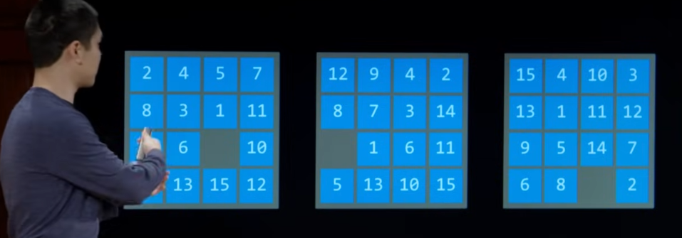
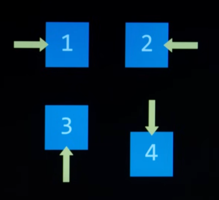
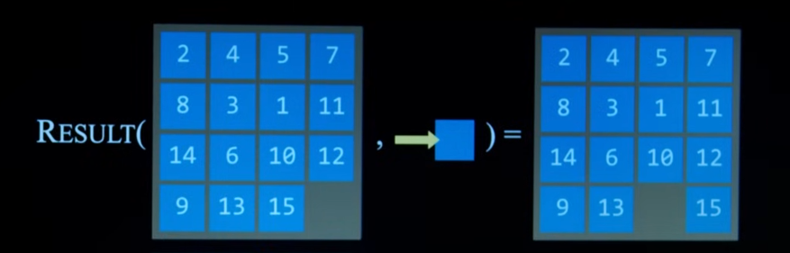
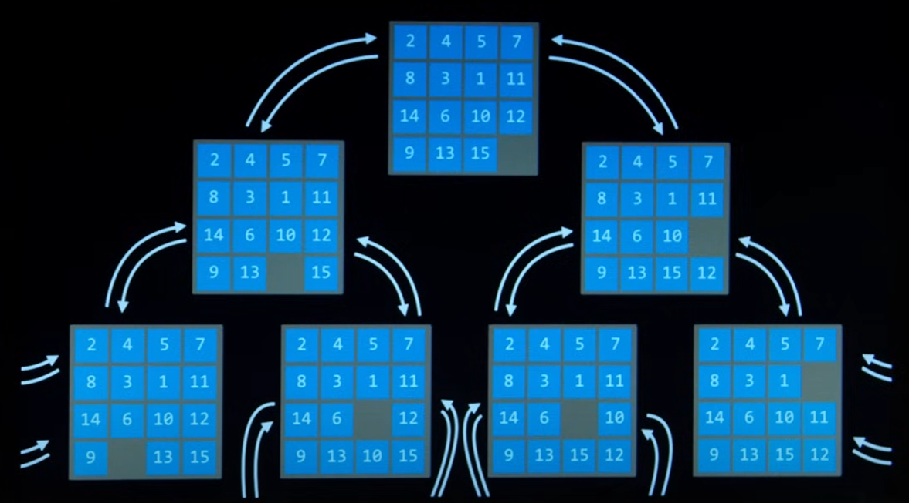
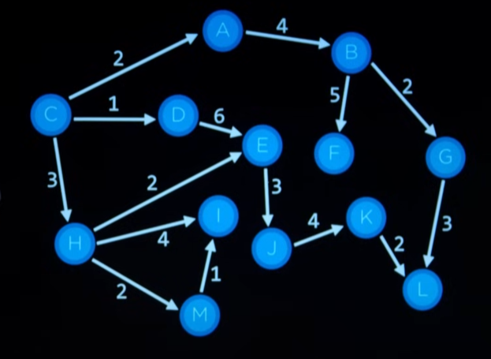
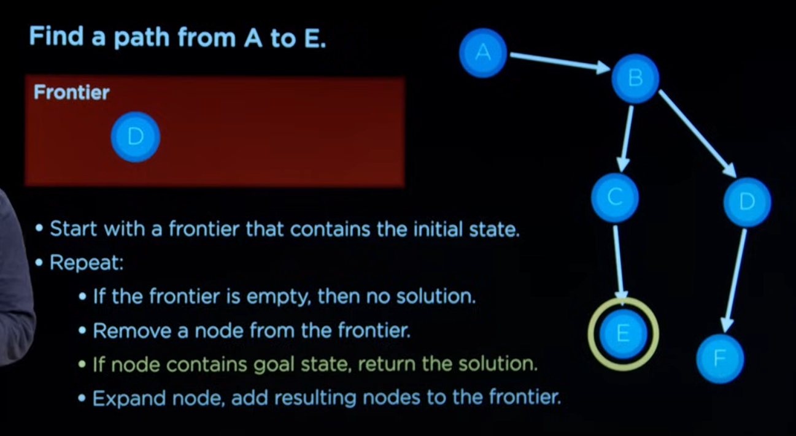

## Terminologia en Search Problems

1. Agente: Entidad con la capacidad de percibir las condiciones de su entorno y actuar sobre el en consecuencia. Si ponemos como ejemplo el problema de encontrar la mejor ruta para llegar a un destino, nuestro agente seria una representacion de un conductor de un vehiculo.

2. State: Configuracion del agente o de su entorno que altera el la resolucion del problema por parte del agente.



> Diferentes secuencias de acciones tendran que ser ejecutadas para resolver un mismo problema con diferentes estados de entorno para el agente.

3. Initial state: Es la configuracion inicial del entorno o del propio agente al momento de comenzar la resolucion del problema, que a lo largo de este proceso sera alterado.

4. Actions: Elecciones que toma el agente para resolver el problema dado del initial state proporcionado. Podemos representar matematicamente todas las acciones que puede ejecutar nuestro agente sobre un entorno determinado mediante la siguiente funcion.

```math
ACTIONS(s)
```

> Para diferentes estados es totalmente factible que no dispongamos del mismo conjunto de acciones.



5. Transition model: De alguna manera nuestro programa de inteligencia artificial necesitara algun tipo codificacion del estado y de las acciones (por lo general con un formato numerico), por ende tambien para los estados resultantes tras ejecutar las posibles acciones sobre los estados. Un transition model por lo tanto, describe como es alterado un entorno antes una determinada accion.

```math
RESULT(s, a)
```

La funcion $\textit{RESULT(s, a)}$ es por lo tanto una representacion matematica de un transition model.



6. State space: Consiste en una representacion de todos los estados alcanzables. Podemos pensar en el state space como un arbol de posibilidades por el que en el que nos podemos desplazar y a medida lo que hacemos nos surgen diferentes tipos acciones que podemos ejecutar sobre el entorno y asi volver a desbloquear un nuevo estado con nuevas posibilidades.



7. Goal test: Consiste en un mecanismo para determinar cuando el agente consiguio resolver el problema. En algunos casos es sencillo saber si el problema fue resuelto, pero en otros incluso podemos tener diferentes posibles soluciones a un mismo problema y puede llegar a ser mas complicado.

8. Path cost: Ayuda a determinar al agente cual es la mejor solucion al problema en lugar de dar simplemente dar cualquier solucion al mismo. Cada accion de $\textit{ACTIONS(s)}$ se le proporciona un "peso" o "coste" y esto ayuda al agente a desplazarse sobre el state space con el objetivo de encontrar la mejor solucion al problema. En algunas ocasiones el path cost puede ser igual para cualquier accion sobre el estado (ese es el caso del ejemplo del sliding tile puzzle donde el costo de mover cualquier pieza, o en otras palabras, ejecutar una accion, siempre conlleva el mismo coste y por lo tanto el path cost total sera determinado unicamente determinado por la cantidad de veces que el agente ha tenido que saltar entre diferente estados). El path cost por lo tanto representa el costo total que se necesitara para resolver el problema y permite decartar soluciones menos optimas que tienen un mayor coste.



9. Solution: La solucion a un problema es por lo tanto la secuencia de acciones oportunas para resolver un problema correctamente (o al menos rorrectamente dentro de los que estipula el goal test)

10. Node: Desde la perspectiva de la programacion, acuerdo para resolver un problema de busqueda necesitaremos alguna suerte de estructura de datos encargada de contener toda la informacion necesaria para construir el state spaces por el que nuestro agente se desplazara. Cada una de estas estructuras de datos las denominaremos nodes y contendran algunos de los terminos anteriormente descritos:

- un state
- una referencia al nodo padre (con el estado antes de habar ejecutado la accion)
- la accion (la accion aplicada al estado del nodo padre para haber logrado el estado del nodo actual)
- el path cost (el costo del nodo padre en convertir su estado con la accion seleccionada)

Es de vital importancia tener una referencia al nodo padre para saber cual fue el camino tomado al momento de haber logrado una solucion. Ademas, el valor para path cost es acumulativo para los nodos, siendo las soluciones "peores" a los problemas aquellas con un path cost muy elevado.

11. Frontier: Consiste en una estructura de datos que representa los nodos que quedan por explorar. Se sigue un enfoque donde nodos recientemente descubiertos son introducidos en el frontier, analizados por el goal test, eliminados del frontier y finalmente expandidos (se agregan los nodos conectados al frontier)

## Depth-First Seach Algorithm

- En primer lugar nuestro algoritmo de busqueda comenzara con un frontier que solamente incluira el initial state.

Repetiremos:

- Verificaremos si el frontier esta vacio, en cuyo caso no habra nodos por explorar y por lo tanto no habra solucion

- Eliminamos el nodo actual del frontier

- Comprobaremos que el nodo pasa el goal test

- Expandimos el nodo, es decir, añadimos los nodos conectados al nodo actual al frontier



Uno de los principales problemas que tiene este enfoque lo podemos encontrar si admitimos la posibilidad de un nodo de volver a su estado anterior (por ejemplo el problema del sliding tiles puzzle, donde podemos regresar las piezas back and forth). Formaremos un bucle infinito donde los nodos ya explorados volveran a ser continuamente analizados.

Para solucionar este problema debemos crear un mecanismo que nos ayude a saber que nodos hemos explorado.

Nuestro nuevo enfoque mejorado se veria de la siguiente manera:

- Inicializamos el frontier con el initial state

- Creamos una estructura de datos inicialmente vacia que contendra el conjunto de estados explorados.

Repetiremos:

- Verificaremos si el frontier esta vacio, en cuyo caso no habra nodos por explorar y por lo tanto no habra solucion

- Eliminaremos el nodo del frontier

- Comprobaremos el el nodo pasa el goal test

- Agregaremos el nodo a al conjunto de nodos explorados

- Expandiremos el nodo, es decir, añadiremos los nodos conectados al frontier si estos no existen en el frontier ni el la estructura de nodos ya explorados

En este algoritmo recursivo el frontier se comporta como un stack (last-in first-out) y permite analizar todas las ramas del state space en su maxima profundidaz. Tras llegar a la maxima profundidaz de una rama, el frontier comienza a analizar otra rama diferente comenzando desde ot(este concepto es conocido como Depth-First Search)

## Breadth-First Seach Algorithm

Este algoritmo de busqueda es identico al Depth-First Seach aunque con una pequeña diferencia, en este caso el frontier no se comporta como un stack (last-in first-out) sino como una queue (first-in first-out). Ademas, no busca profundizar por completo cada una de las ramas, sino conocer todos los nodos disponibles desde cada nivel del arbol.
