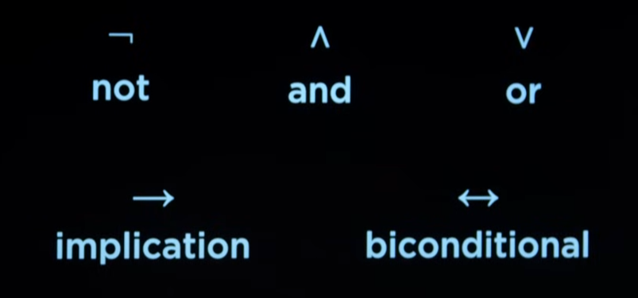

# Knowledge-Based Agents

Los agentes de inteligencia artificial basados en conocimiento operan sobre una representacion interna de conocimiento con el fin de saber lo que significa saber algo u obtener informacion adicional a lo que es conocido con el fin de resolver problema determinado.

Las siguientes tres frases forman proposiciones que afirman hechos

De las anteriores frases podemos inferir la siguiente informacion adicional:

- **Harry no visita a Hagrid hoy**: Pesto que harry esta visitando hoy a Dumbledore (y no puede visitar a los dos al mismo tiempo)

- **Esta lloviendo**: Porque si no lloviera Harry estaria visitando a Hagrid, sin embargo esta visitando a Dumbledore

## Propositional Logic

La logica proposicional consiste en el razonamiento basado en afirmaciones sobre el mundo y conforman una representacion interna de conocimiento. Cada una de estas proposiciones que afirman hechos las conocemos como `sentences`.

De acuerdo para codificar estas sentences, le otorgamos a cada una un `propositional symbol` (que por lo general suelen ser letras)

Para razonar o inferir informacion adicional a estos hechos, necesitamos algun mecanismo de enlace entre estos simbolos proposicionales (de ahora en adelante simplemente simbolos). Estos son los `logical connectives`:

- **not**: El connectivo logico `not` invierte el significado de las afirmaciones.

- **and**: El connectivo logico `and` reune dos simbolos y verifica que ambas proposiciones sean positivas.

- **or**: El connectivo logico `or` reune dos simbolos y verifica si al menos uno de los dos (o los dos) es una afirmacion positiva

11:14