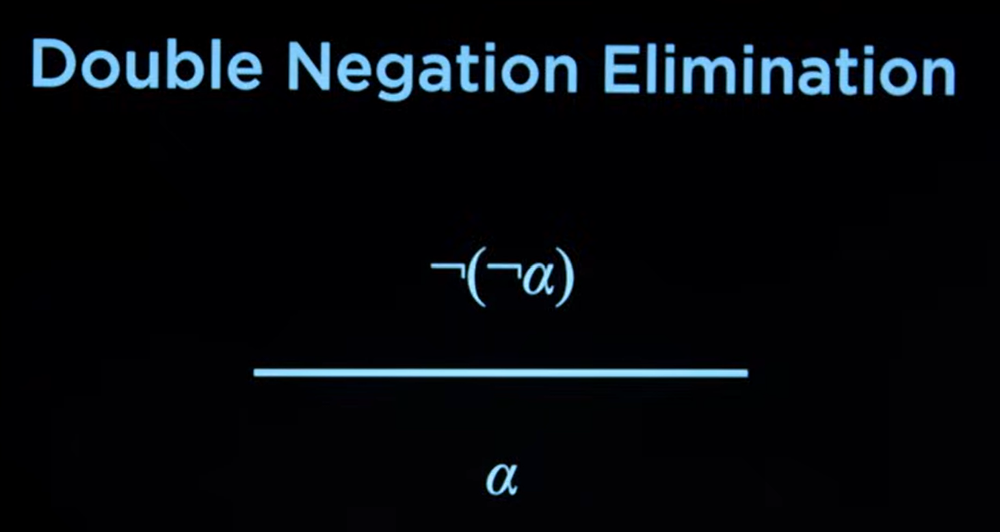

# Knowledge-Based Agents

Los agentes de inteligencia artificial basados en conocimiento operan sobre una representacion interna de conocimiento con el fin de saber lo que significa saber algo u obtener informacion adicional a lo que es conocido con el fin de resolver problema determinado.

Las siguientes tres frases forman proposiciones que afirman hechos

De las anteriores frases podemos inferir la siguiente informacion adicional:

- **Harry no visita a Hagrid hoy**: Pesto que harry esta visitando hoy a Dumbledore (y no puede visitar a los dos al mismo tiempo)

- **Esta lloviendo**: Porque si no lloviera Harry estaria visitando a Hagrid, sin embargo esta visitando a Dumbledore

# Propositional Logic

La logica proposicional consiste en el razonamiento basado en afirmaciones sobre el mundo y conforman una representacion interna de conocimiento. Cada una de estas proposiciones que afirman hechos las conocemos como `sentences` (afirman pero no tienen por que ser ciertas).

De acuerdo para codificar estas sentences, le otorgamos a cada una un `propositional symbol` (que por lo general suelen ser letras)

Para razonar o inferir informacion adicional a estos hechos, necesitamos algun mecanismo de enlace entre estos simbolos proposicionales (de ahora en adelante simplemente simbolos). Estos son los `logical connectives`:

- **not**: El connectivo logico `not` invierte el significado de las afirmaciones.

- **and**: El connectivo logico `and` reune dos simbolos y verifica que ambos son verdaderos

- **or**: El connectivo logico `or` reune dos simbolos y verifica si al menos uno de los dos (o los dos) es verdadero

- **implication**: El connectivo logico `implication` reune dos simbolos (P y Q, por ejemplo) y solamente retorna false si P es true, pero Q es false. Podemos verlo como: Si P es false, entonces Q puede tener cualquier valor; si P es true, Q solamente puede ser true.

Si Harry visita a Dumbledore (y esta afirmacion es cierta), pero no esta lloviendo (para el ejemplo, una afirmacion falsa); false sera el resultado de la implicacion para los dos simbolos en ese universo. Si inviertieramos la afirmacion "no esta lloviendo", es decir, si pasara a ser "si esta lloviendo", en este universo el resultado de la implicacion entre ambos simbolos seria true. Diferentes resultados para mismos connectivos logicos en mismos simolos son obtenidos, de ahi proviene la idea de razonar con lo que es conocido para el agente.

- **biconditional**: El connectivo logico `biconditional` es similar al `implication`. Retorna true para cuando ambos simbolos son igualmente ciertos o igualmente falsos.

Siguiendo con el ejemplo anterior, podemos encontrar un fallo logico al utilizar `implication`. Si la primera afirmacion no es cierta y la seguda afirmacion si lo es, existiria implicacion. Para el ejemplo dado seria mas adecuado un `bicondicional implication` connective.

## Model

En un sistema de representacion de conocimiento basado en logica proposicional, un modelo es un contenedor que agrupa relaciones de veracidad con respecto a cada una de las `sentences`. Cada posible configuracion que pueda tener nuestro modelo podemos decir que es un universo diferente, donde el razonamiento aplicado generara resultados diferentes dada la naturaleza del valor asignado sobre cada proposicion de afirmacion incluida en este contenedor.

> Para un modelo no heuristico, y que por lo tanto incluye afirmaciones que solamente pueden ser verdaderas o falsas, el numero de posibilidades (o numero de universos posibles) es `2^n`, donde `n` es la cantida de `sentences`.

## Knowledge base

Representa todas las sentences al alcance de un agente basado en conocimiento.

## Entailment

Mecanismo de consulta / inferencia de un simbolo determinado en un modelo (modelo en cuyo caso el simbolo ha de estar presente) contra una base de conocimiento.

De esta manera, podemos representar la idea de: "Con el conocimiento presente, podemos decir que esta lloviendo ?" con la siguiente expresion:

## Algorithms

### Model Checking

Model checking es por lo tanto un algoritmo para hacer entailment con una base de conocimiento y simbolo determinado $α$, que consiste en iterar sobre todos los modelos y verificar sobre cada uno, si el knowledge base es verdadero y ademas el simbolo se encuentra con el mismo valor en el modelo/modelos compatible con la base de conocimiento.

Es totalmente factible construir una base de conocimiento (kb) compatible con mas de un modelo al mismo tiempo (de ahi que cada uno de ellos no solamente tiene que ser compatible con el kb, si no que tambien tiene que incluir el simbolo consultado con el mismo valor).

Puede darse el caso donde tengamos varios modelos compatibles para una base de conocimiento y que el valor para el simbolo dentro de los modelos sea arbitrario. Esto significa que algoritmo no tiene consenso a ciencia cierta sobre si existe o no inferencia sobre ese simbolo consultado (podriamos incluso hacer un calculo de probabilidad y analizar que tan probable es que sea cierta la inferencia del simbolo).

Model checking no es un algoritmo perfecto. Si bien podemos intentar optimizar el rendimiento de este, es un algoritmo poco eficiente. Esto es mas notorio a medida que incrementamos el numero de simbolos en la base de conocimiento.

De acuerdo para evitar iterar sobre todos los modelos posibles, existen mecanismos como las `inference rules`. Que permiten sintetizar el conocimiento actual en nuevas formas de conocimiento.

### Inference rules

Una forma de representar `inference rules` es mediante una linea horizontal. Encima de la linea tenemos una premisa, algo que en definitiva sabemos que es verdadero, y debajo las conslusiones a las que podemos llegar tras aplicar las reglas de inferencia.

- **Modus Ponens**: Este tipo de regla es aplicada para simplificar implicaciones entre dos simbolos (alpha y beta).

Se basa en la premisa de que alpha es verdadero, en cuyo caso el nuevo conocimiento inferido es beta.

No estamos tratando con ningun modelo en particular si no con el conocimiento que sabemos.

- **And Elimination**: Esta regla de inferencia toma la premisa de que si dos simbolos unidos por un conectivo `and` son verdaderos (alpha y beta), entonces el conocimiento inferido puede simplificarse simplemente a "es alpha/beta verdadero" en lugar de "es alpha y beta verdadero".

- **Double Negation Elimination**: Esta regla de inferencia se basa en la premisa de que un simbolo doblemente negado es lo mismo que no negarlo desde un principio.

- **Implication Elimination**: Se basa en la premisa de que una implicacion resulta igual que negar el antecedente y unirlo al consecuente con un conectivo `or`.

- **Biconditional Elimination**: Se basa en la premisa de que dos implicaciones unidas por el connectivo `and` hacen la misma funcion que un biconditional

- **Morgan's Law**: Una de las leyes de Morgan puede ser utilizada como regla de inferencia. Esta pone como premisa que una matriz de simboloss unidos con `and` y posteriormente la negacion total de la expresion es equivalente a una matriz simbolos negados unidos por `or`.

La ley de Morgan tambien es aplicarle al caso contrario donde negamos una matriz de simbolos unidos por `or`, de donde podemos sacar la conclusion de que nos estamos enfrentando a una matriz de simbolos negados unidos por `and`.

- **Distributive Property**: La propiedad distributiva comummente empleada en matematicas con la finalidad de hacer calculos cotidianos tambien puede ser empleada en este conexto de relaciones entre simbolos con conectivos logicos.

### Theorem Proving

Consiste en una tecnica que combina algoritmos de busquda con knowledge engineering con el fin de hacer inferencias de manera considerablemente mas eficiente.

### Unit Resolution Rule

Sobre esta regla se basa otro algoritmo de inferencia de conocimiento. En la regla de union de resolucion disponemos de dos literales diferentes, cada uno de los cuales contradice al otro. Pensemos por un momento en los simbolso alpha y beta; la idea es que si alpha es falso, entonces beta es verdadero por descarte; por el contrario si alpha, si sabemos que alpha es verdadero, entonces beta tiene que ser falso.

Esto es expresable con logica proposcional de la siguiente manera:

Cada uno de los literales en esta regla de inferencia no esta limitado a ser un unico simbolo, en su lugar puede haber una compleja relacion de simbolos y connectivos logicos anidados.

De vez en cuando podemos toparnos con un caso donde la regla infiera mas de un simbolo al mismo tiempo. Si disponemos de un conocimiento inicial que dice: "Ron esta en el salor **o** Hermion esta en la biblioteca" y tomamos como accion esta regla, agregando tambien la siguiente informacion en adicion: "Ron no esta en el salor **y** Harry esta durmiendo":

Seremos capaces de inferir el siguiente nuevo conocimiento:

 - Hermion esta en la biblioteca **o**
 - Harry esta durmiendo

Si trataramos de inferir conocimiento con `unit resolution` sobre una base de conocimiento inicial `Or(Q, Not(Q))` (una clausula nula), obtendremos como inferencia false.

Precisamente en este principio de clausulas nulas nos basamos para el algoritmo de inferencia por resolucion.

### Inference by Resolution

De acuerdo para determinar si existe entailmente entre un simbolo determinado en una base de conocimiento utilizamos el principio de prueba por contradiccion (proof by contradiction).

A partir de `And(KB, Not(A))` (union de clausulas en forma conjuntiva), buscaremos crear inferir nuevas clausulas con alguna de las `inference rules`.

En la nueva conjuncion buscaremos clausulas nulas (`And(Q, Not(Q))`); en cuyo caso habremos encontrado entailment del simbolo `A` con la base de conocimiento proporcionada.

Si tras haber inferido todas las clausulas posibles no nos topamos con ningun clausula nula, entonces no habra entailment con el simbolo

Podemos decir `kb` es verdadero y `A` lo es tambien.

## First-Order Logic

Todos los anteriores algoritmos estan basados en logica proposicional. La logica proposicional puede ser ineficiente en situaciones como el juego mastermind o puzzle por la cantidad de simbolos que tenian que ser creados (cada simbolo solamente puede tener un valor booleano).

En la logica de primer orden disponemos dos tipos diferentes de simbolos:

 - **constant**: Ya no representa la "verdad" de una proposicion de afirmacion con un valor booleano, y en su lugar representa un objeto.

 - **predicate**: Actuan como un verificador de cualidades sobre un simbolo constante, por lo tanto retornan un booleano

> El logica de primer orden tambien disponemos de conectivos logicos.

### Quantifiers

En logica de primer nivel disponemos de mecanismo para representar ideas incluso mas complejas (comunmente conocidos como `quantifiers`)

- **global quantification**: Permite expresar la idea de que algo va a ser verdadero para todos los valores de una variable.

> En la imagen de arriba x puede asumir cualquier simbolo constante; por lo tanto, todas las personas que pertenezcan a Gryffindor no pertenecen a Hufflepuff.

- **existencial quantification**: Expresa la idea de que algo sera verdadero bajo ciertos valores de una variable.

> En este caso, x representan todas las casas a las que pertenece Minerva

