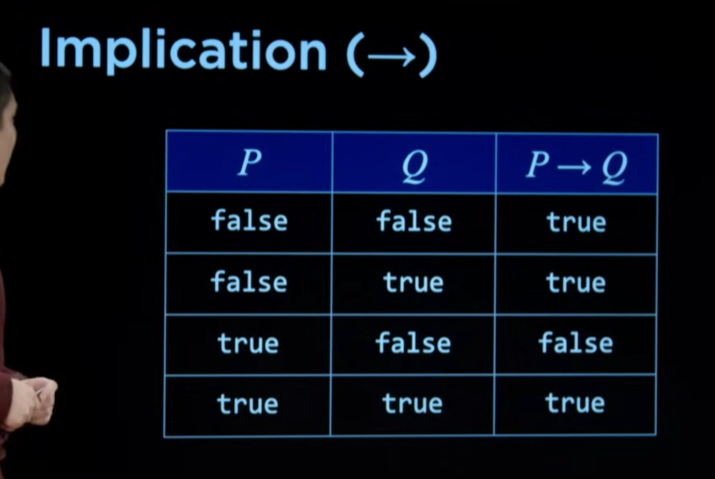

# Knowledge-Based Agents

Los agentes de inteligencia artificial basados en conocimiento operan sobre una representacion interna de conocimiento con el fin de saber lo que significa saber algo u obtener informacion adicional a lo que es conocido con el fin de resolver problema determinado.

Las siguientes tres frases forman proposiciones que afirman hechos

De las anteriores frases podemos inferir la siguiente informacion adicional:

- **Harry no visita a Hagrid hoy**: Pesto que harry esta visitando hoy a Dumbledore (y no puede visitar a los dos al mismo tiempo)

- **Esta lloviendo**: Porque si no lloviera Harry estaria visitando a Hagrid, sin embargo esta visitando a Dumbledore

# Propositional Logic

La logica proposicional consiste en el razonamiento basado en afirmaciones sobre el mundo y conforman una representacion interna de conocimiento. Cada una de estas proposiciones que afirman hechos las conocemos como `sentences` (afirman pero no tienen por que ser ciertas).

De acuerdo para codificar estas sentences, le otorgamos a cada una un `propositional symbol` (que por lo general suelen ser letras)

Para razonar o inferir informacion adicional a estos hechos, necesitamos algun mecanismo de enlace entre estos simbolos proposicionales (de ahora en adelante simplemente simbolos). Estos son los `logical connectives`:

- **not**: El connectivo logico `not` invierte el significado de las afirmaciones.

- **and**: El connectivo logico `and` reune dos simbolos y verifica que ambos son verdaderos

- **or**: El connectivo logico `or` reune dos simbolos y verifica si al menos uno de los dos (o los dos) es verdadero

- **implication**: El connectivo logico `implication` reune dos simbolos (P y Q, por ejemplo) y solamente retorna false si P es true, pero Q es false. Podemos verlo como: Si P es false, entonces Q puede tener cualquier valor; si P es true, Q solamente puede ser true.

Si Harry visita a Dumbledore (y esta afirmacion es cierta), pero no esta lloviendo (para el ejemplo, una afirmacion falsa); false sera el resultado de la implicacion para los dos simbolos en ese universo. Si inviertieramos la afirmacion "no esta lloviendo", es decir, si pasara a ser "si esta lloviendo", en este universo el resultado de la implicacion entre ambos simbolos seria true. Diferentes resultados para mismos connectivos logicos en mismos simolos son obtenidos, de ahi proviene la idea de razonar con lo que es conocido para el agente.

- **biconditional**: El connectivo logico `biconditional` es similar al `implication`. Retorna true para cuando ambos simbolos son igualmente ciertos o igualmente falsos.

Siguiendo con el ejemplo anterior, podemos encontrar un fallo logico al utilizar `implication`. Si la primera afirmacion no es cierta y la seguda afirmacion si lo es, existiria implicacion. Para el ejemplo dado seria mas adecuado un `bicondicional implication` connective.

## Model

En un sistema de representacion de conocimiento basado en logica proposicional, un modelo es un contenedor que agrupa relaciones de veracidad con respecto a cada una de las `sentences`. Cada posible configuracion que pueda tener nuestro modelo podemos decir que es un universo diferente, donde el razonamiento aplicado generara resultados diferentes dada la naturaleza del valor asignado sobre cada proposicion de afirmacion incluida en este contenedor.

> Para un modelo no heuristico, y que por lo tanto incluye afirmaciones que solamente pueden ser verdaderas o falsas, el numero de posibilidades (o numero de universos posibles) es `2^n`, donde `n` es la cantida de `sentences`.

## Knowledge base

Representa todas las sentences al alcance de un agente basado en conocimiento.

## Entailment

Mecanismo de consulta / inferencia de un simbolo determinado en un modelo (modelo en cuyo caso el simbolo ha de estar presente) contra una base de conocimiento.

De esta manera, podemos representar la idea de: "Con el conocimiento presente, podemos decir que esta lloviendo ?" con la siguiente expresion:

## Algorithms

### Model Checking

Model checking es por lo tanto un algoritmo para hacer entailment con una base de conocimiento y simbolo determinado $α$, que consiste en iterar sobre todos los modelos y verificar sobre cada uno, si el knowledge base es verdadero y ademas el simbolo se encuentra con el mismo valor en el modelo/modelos compatible con la base de conocimiento.

Es totalmente factible construir una base de conocimiento (kb) compatible con mas de un modelo al mismo tiempo (de ahi que cada uno de ellos no solamente tiene que ser compatible con el kb, si no que tambien tiene que incluir el simbolo consultado con el mismo valor).

Puede darse el caso donde tengamos varios modelos compatibles para una base de conocimiento y que el valor para el simbolo dentro de los modelos sea arbitrario. Esto significa que algoritmo no tiene consenso a ciencia cierta sobre si existe o no inferencia sobre ese simbolo consultado (podriamos incluso hacer un calculo de probabilidad y analizar que tan probable es que sea cierta la inferencia del simbolo).

Model checking no es un algoritmo perfecto. Si bien podemos intentar optimizar el rendimiento de este, es un algoritmo poco eficiente. Esto es mas notorio a medida que incrementamos el numero de simbolos en la base de conocimiento.
