# Uncertanty

Anteriormente estuvimos cubriendo el concepto de ingenieria de conocimiento. Codificabamos conocimiento (logia proposicional o del primer orden) y a partir de ahi eramos capaces de inferir nueva informacion que nos ayudaba a llegar a nuevas conclusiones.

Hasta el momento solamente hemos considerado como validos los simbolos que encajaban al 100% como verdaderos segun el conocimiento presente en el kb. Sin embargo en esta leccion introduciremos el conceptor de probabilidad en la inferencia.

Cada una de las posibles inferencias es verdadera bajo un porcentaje de probabilidad. La probabilidad de que una inferencia determinada (universo) sea verdadera puede ser representada matematicamente:

```math
P(W)
```

Que tan probable que suceda un evento es representado por un numero que puede ir del 0 al 1. Esto significa que la probabilidad de tirar un dado y obtener un 7 es de 0, mientras que la probabilidad de tirar un dado y que el numero sea inferior a 10 es de 1.

La suma de probabilidades para todos los "universos" tiene que dar como resultado 1. Esto es representable de la siguiente forma:


Siguiendo con el ejemplo de un dado, tenemos 6 posibles; cada una de ellas es igual de igual de probable obtenerla (suponiendo que no es un dado trucado). Esto significa que cada cara tiene una probabilidad de $\frac{1}{6}$ de ser verdadera ($\frac{1}{6} * 6 = 1$).

Podriamos agregar a la ecuacion un segundo dado, esto significa una probabilidad de $\frac{1}{36}$. Ahora; si bien es igual de probable sacar 5 y 2 que 6 y 3 en los dados, no existe la misma probabilidad para sacar el mismo resultado en la suma entre ambos dados. La suma mas corriente es de 7 ($\frac{6}{36} = \frac{1}{6}$), cuya probabilidad es identica a la de cada una de las caras de un solo dado.


# Unconditional Probability

Este tipo de deducciones de probabilidad que somos capaces de crear desde la nada (como es el caso de los dados, donde deducimos una probabilidad sin basandonos en ningun evidencia) constituyen la `unconditional probability`

# Conditional Probability

Por el contrario la probabilidad condicional se fundamenta en evidencias ya reveladas con antelacion. La informacion ya conocida altera la probabildad de que un determinado simbolo sea verdadero.

> Cual es la probabilidad de A dado el valor de B ?


Que es equivalente a la probabilidad de que ambos simbolso A y B sean verdaderos dividido de la probabilidad de que B sea verdadero:

```math
\frac{P(A\ Ʌ\ B)}{P(B)}
```

El valor para la probabilidad ( $[0, 1]$ ) esta directamente relacionado (por no decir que es lo mismo) al numero de universos posibles.

Siguiendo este razonamiento y en relacion a
$\frac{P(A\ Ʌ\ B)}{P(B)}$, podemos verlo como `universos posibles donde A y B` / `universos posibles donde B`. Dividimos entre $P(B)$ porque para sacar la probabilidad de $P(A\ Ʌ\ B)$ ha sido necesario calcular el producto de la probabilidad de ambos $P(A) * P(B)$; de esta manera sacamos a $P(B)$ de la ecuacion.

> En el escenario de los dados, donde es igual de probable cada combinacion, el calculo de probabilidad condicional es $P(A\ |\ B)\ =\ P(A)$.


> Cual es la probabilidad de que la suma de ambos dadots sea 12 sabiendo que el dado rojo es 6

# Random Variable

En teoria de probabilidad buscamos en ocasiones representar una idea con variables que pueden asurmir un valor determinado dentro de un dominio de posibilidades.

> Espacio de valores posibles para la variable aleatoria `roll`.


## Probability Distribution

Amenudo representamos la distribucion de probabilidad sobre cada uno de los valores de la variable aletoria con un vector (matriz de valores)


# Independence

Consiste en la falta de relacion al momento de calcular la probabilidad de dos simbolos diferentes.

El juego de los dos dados es un claro ejemplo de independencia en teoria de probabilidad y es que como cada jugada es aleatoria, no existe relacion alguna entre la tirada del primer y el segundo dado.

Si estuvieramos discutiendo si esta o no lloviendo, esta probabilidad seria alterada (no independiente) del factor "el cielo esta nubloso".

Si estamos topandonos con un caso de probabilidad independiente podemos simplificar la ecuacion de probabilidad conditional

> Buscando probabilidad de `A` asumiendo que `B` es verdadero

```math
P(A\ |\ B) = \frac{P(A\ Ʌ\ B)}{P(B)}
```

De la siguiente manera

```math
P(A) = \frac{P(A\ Ʌ\ B)}{P(B)}
```

O lo que es igual

```math
P(A\ Ʌ\ B) = P(A)\ *\ P(B)
```

Volviendo al problema de los dados, podemos forzar un comportamiento no independiente si buscamos que un mismo dado tenga dos valores diferentes el mismo tiempo.

> Al mostrar un comportamiento no independiente:

```math
P(Roll\ =\ 6\ Ʌ\ Roll\ =\ 1)\ !=\ P(A)\ *\ P(B)
```

```math
0\ !=\ \frac{1}{6}\ *\ \frac{1}{6}
```

> De manera que para hacer el calculo de probabilidad condicional tenemos que tener en cuenta que tan probable es `B` si `A` es cierto.

```math
P(Roll\ =\ 6\ Ʌ\ Roll\ =\ 1)\ !=\ P(A)\ *\ P(B\ |\ A)
```


# Bayes' Rule

Basandonos en lo anterior y haciendo algo de algebra podemos sacar la forma estandar del teorema de bayes.

Si sabemos que

```math
P(A\ Ʌ\ B)\ =\ P(A)\ *\ P(B\ |\ A)
```

es lo mismo que

```math
P(A\ Ʌ\ B)\ =\ P(B)\ *\ P(A\ |\ B)
```

significa por lo tanto que

```math
P(B)\ *\ P(A\ |\ B) =\ P(A)\ *\ P(B\ |\ A)
```

y por consiguiente el teorema de bayes se representa comunmente con la forma:

```math
P(A\ |\ B)\ =\ \frac{P(B\ |\ A)\ *\ P(A)}{P(B)}
```

Aqui tenemos una aplicacion del teorema de bayes dada la siguiente informacion:

- El 80% de las tardes lluviosas comenzaron con una mañana nublada.

- El 40% de los dias tienen una mañana nublada.

- El 10% de los dias tienen una tarde lluviosa


> Hay un 20% de probabilidad de que llueva por la tarde si por la mañana hay nubes.

# Joint Probability

Consiste en un sistema de distribucion de probabilidad basado en la combinacion de varias random variables. Es empleado para calcular la probabilidad condicional.

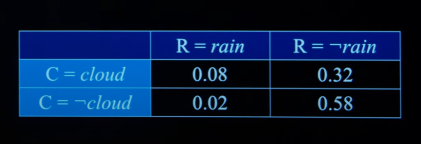

Amenudo utilizamos una forma de resentacion del teorema de bayes que se ve de la siguiente manera:

```math
ɑP(A, B)
```

Cuando buscamos $P(A\ |\ B)$, el coeficiente alpha ha de ser $\frac{1}{P(B)}$, de lo contrario alpha sera $\frac{1}{P(A)}$

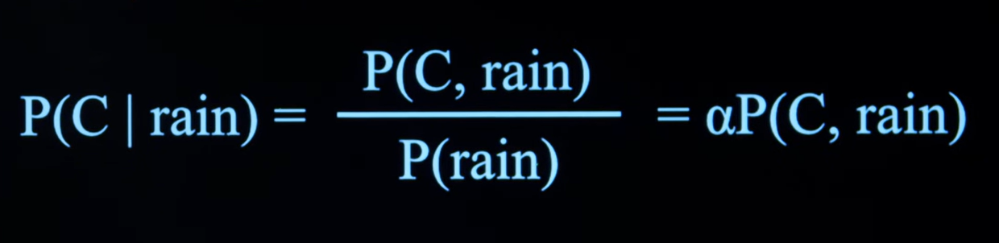

Con esto obtendremos **probabilidad condiconal absoluta** (si no asumimos como verdadero ningun evento, concluimos que hay un 0.02 de probabilidad de que llueva).

Sin embargo podemos calcular esta misma probabilidad condicional con un **valor relativo** a unos eventos / hechos verdaderos.

Esto simplemente lo logramos con el valor de alpha, el cual se convertira un **factor de formalizacion**. Para calcular cual es el valor indicado alpha (en ese caso en particular) tendremos que obtener la inversa de la probabilidad absoluta del evento lluvia $\frac{1}{0.1}$.

Utilizando este factor formalizador obtendremos que el 80% de los dias de lluvia comenzaron con mañanas nublosas y por el contrario, el 20% de las mañanas nublosas terminan en tardes lluviosas.

> De nuevo surge el concepto de sumacion de omega


# Probability Rules

## Negation Rule

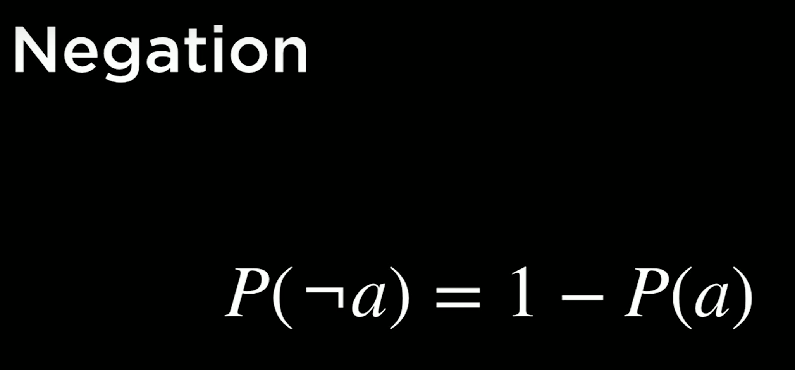

## Inclusion Exclusion Rule

Si bien hemos estado calculando la probabilidad de A y B (sean o no independientes) con $ɑ(P(A)\ *\ P(B))$ utilicaremos la siguiente regla para obtener la probabilidad de A o B

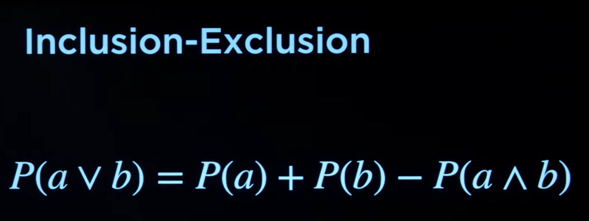

## Marginalization Rule

Para el calculo de probabilidad de eventos booleanos, el teorema tiene la siguiente forma:

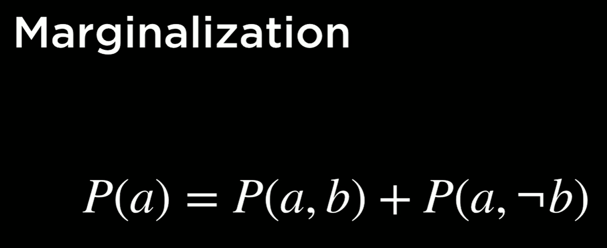

Aunque tambien es aplicable en situaciones donde tratamos con random variables, en cuyo caso la ecuacion tendra la siguiente representacion:

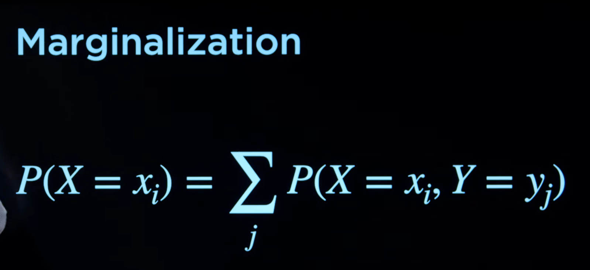

## Conditioning Rule

El teorema de condicionamiento en el fondo es equivalente al de marginalizacion con la diferencia del factor de formalizacion.

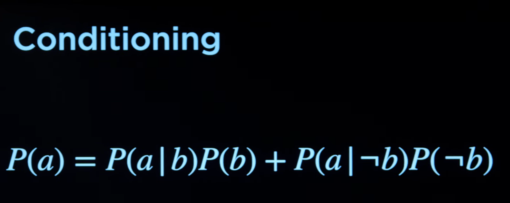

O para variables aleatorias

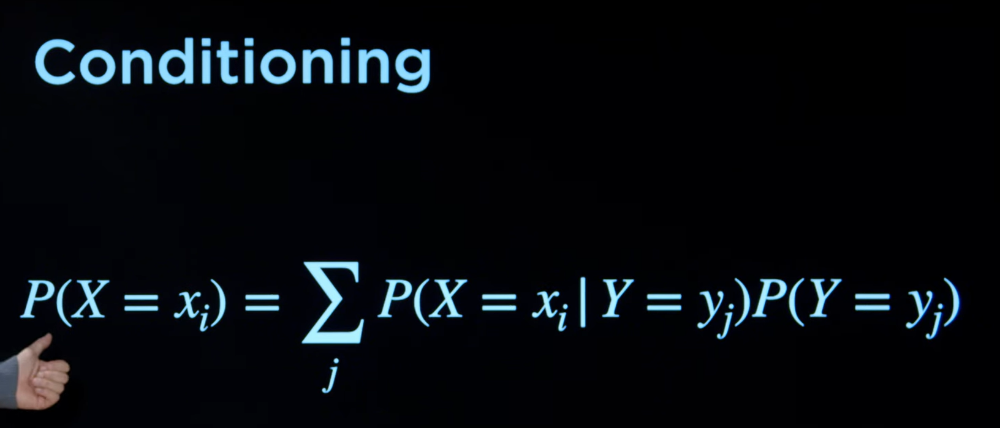

# Bayesian Network

Las redes de bayes son una estructura de datos que representa la relacion entre el valor de las variables aleatorias. Ejemplo: Si esta lloviendo el autobus se retrasara.

- Las redes de bayes son representables como un grafico de direcciones

- Cada nodo representa una variable aleatoria

- Una flecha desde un nodo `X` apuntando a un nodo `Y` significa que `X` es el nodo padre de  ` Y`.

- Cada nodo `X` almacena su distribucion de probabilidad asumiendo que el nodo padre es verdadero $P(X\ |\ Parents(X))$. Una forma intuitiva de ver esto consiste en pensar en la idea de que cada nodo va a desbloquear nuevas probabilidades de que suceda un evento determinado.

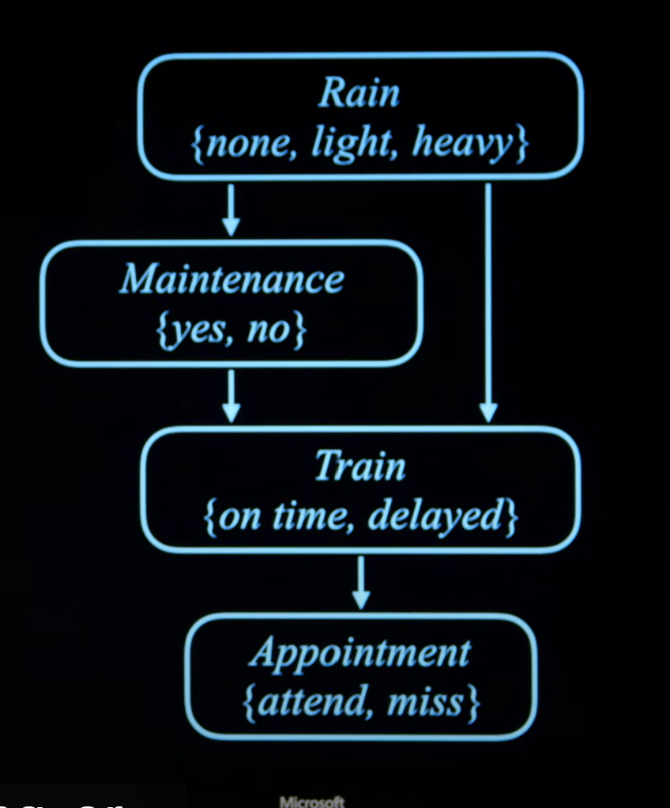

El nodo padre, en este caso la variable aleatoria `rain` es totalmente independiente del resto. Su distribucion de probabilidada de es constante para todos los valores de la variable.

Segun descendemos en la red de bayes se van generando dependencias entre nodos. Un nodo puede tener uno o varios nodos padre. Para calcular una tabla de distribucion de probabilidad condicional sobre un nodo con un solo padre, jugamos todas las combinaciones posibles de la variable aleatoria del unico nodo padre.

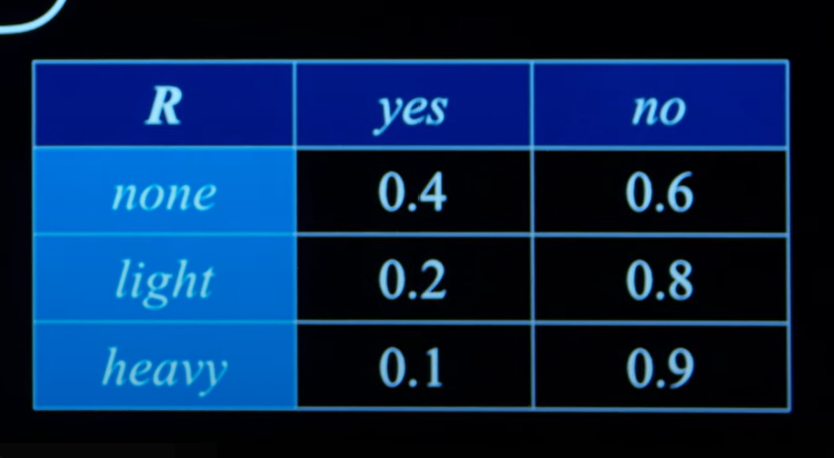

La otra opcion es que un nodo pertenezca a varios nodos padre, en cuyo caso para saber la probabilidad de cada valor de la variable aleatoria del nodo actual, sera necesario jugar todas las combinaciones de de valores de variables aleatorias de nodos padre.

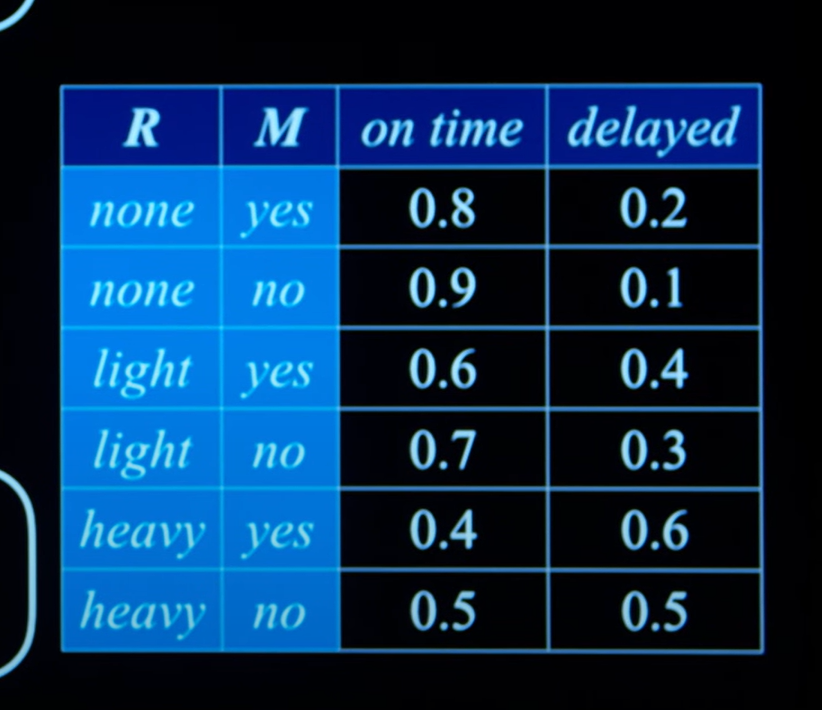

### Calculating multiple joint probability

De acuerdo para calcular la probabilidad conjuntiva, es decir, aquella no relativa a la probabilidad del valor de la variable aleatoria del nodo padre, hemos de seguir un encadenamiento de probabilidades (producto).

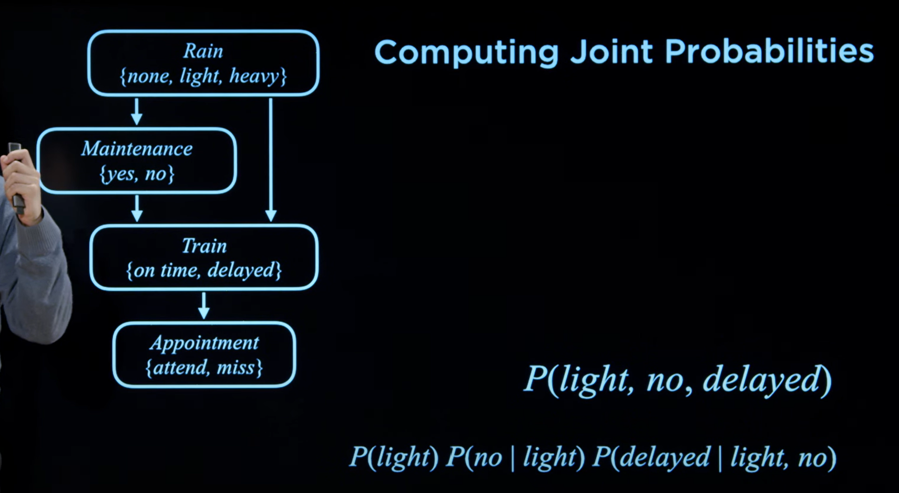

Tambien es posible obtener la probabilidad conjuntiva para los valores de la variable aleatoria del nodo actual por medio de la probabilidad condiconal. En la tabla de distribucion de probabilidad condicional tendremos que sumar todos los valores de cada columa correspondiente a los valores de la variable aleatoria de simbolo actual y multipliciar el resultado por el factor de normalizacion alpha.