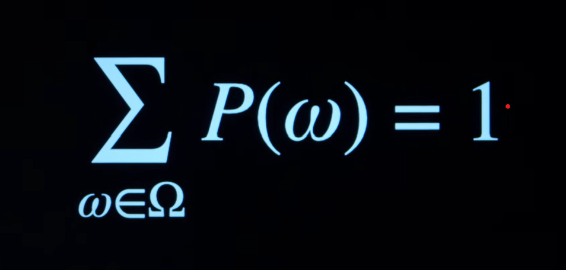
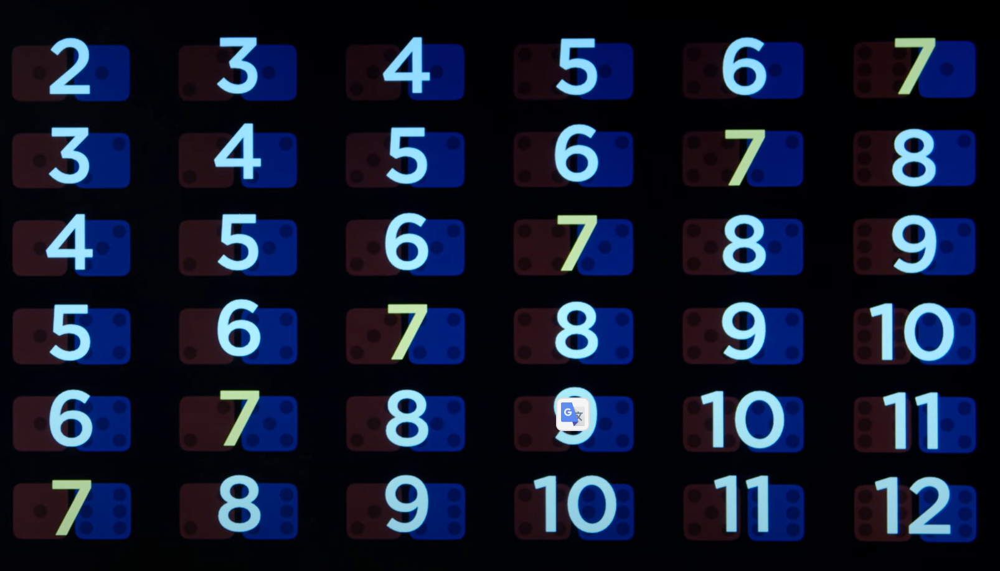
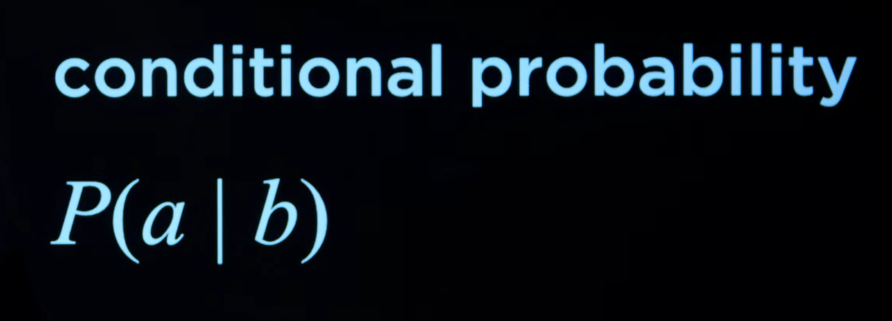

# Uncertanty

Anteriormente estuvimos cubriendo el concepto de ingenieria de conocimiento. Codificabamos conocimiento (logia proposicional o del primer orden) y a partir de ahi eramos capaces de inferir nueva informacion que nos ayudaba a llegar a nuevas conclusiones.

Hasta el momento solamente hemos considerado como validos los simbolos que encajaban al 100% como verdaderos segun el conocimiento presente en el kb. Sin embargo en esta leccion introduciremos el conceptor de probabilidad en la inferencia.

Cada una de las posibles inferencias es verdadera bajo un porcentaje de probabilidad. La probabilidad de que una inferencia determinada (universo) sea verdadera puede ser representada matematicamente:

```math
P(W)
```

Que tan probable que suceda un evento es representado por un numero que puede ir del 0 al 1. Esto significa que la probabilidad de tirar un dado y obtener un 7 es de 0, mientras que la probabilidad de tirar un dado y que el numero sea inferior a 10 es de 1.

La suma de probabilidades para todos los "universos" tiene que dar como resultado 1. Esto es representable de la siguiente forma:



Siguiendo con el ejemplo de un dado, tenemos 6 posibles; cada una de ellas es igual de igual de probable obtenerla (suponiendo que no es un dado trucado). Esto significa que cada cara tiene una probabilidad de $\frac{1}{6}$ de ser verdadera ($\frac{1}{6} * 6 = 1$).

Podriamos agregar a la ecuacion un segundo dado, esto significa una probabilidad de $\frac{1}{36}$. Ahora; si bien es igual de probable sacar 5 y 2 que 6 y 3 en los dados, no existe la misma probabilidad para sacar el mismo resultado en la suma entre ambos dados. La suma mas corriente es de 7 ($\frac{6}{36} = \frac{1}{6}$), cuya probabilidad es identica a la de cada una de las caras de un solo dado.



# Unconditional Probability

Este tipo de deducciones de probabilidad que somos capaces de crear desde la nada (como es el caso de los dados, donde deducimos una probabilidad sin basandonos en ningun evidencia) constituyen la `unconditional probability`

# Conditional Probability

Por el contrario la probabilidad condicional se fundamenta en evidencias ya reveladas con antelacion. La informacion ya conocida altera la probabildad de que un determinado simbolo sea verdadero.

> Cual es la probabilidad de A dado el valor de B ?

