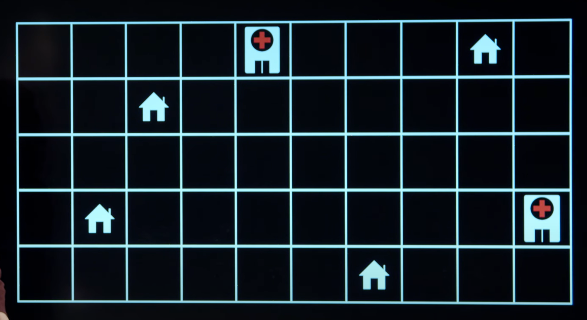
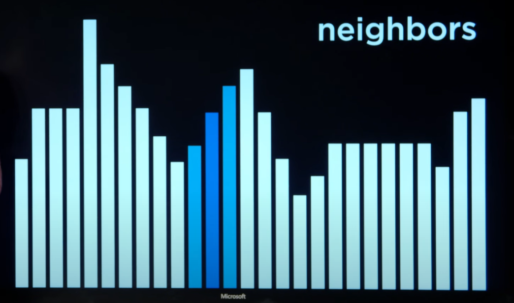
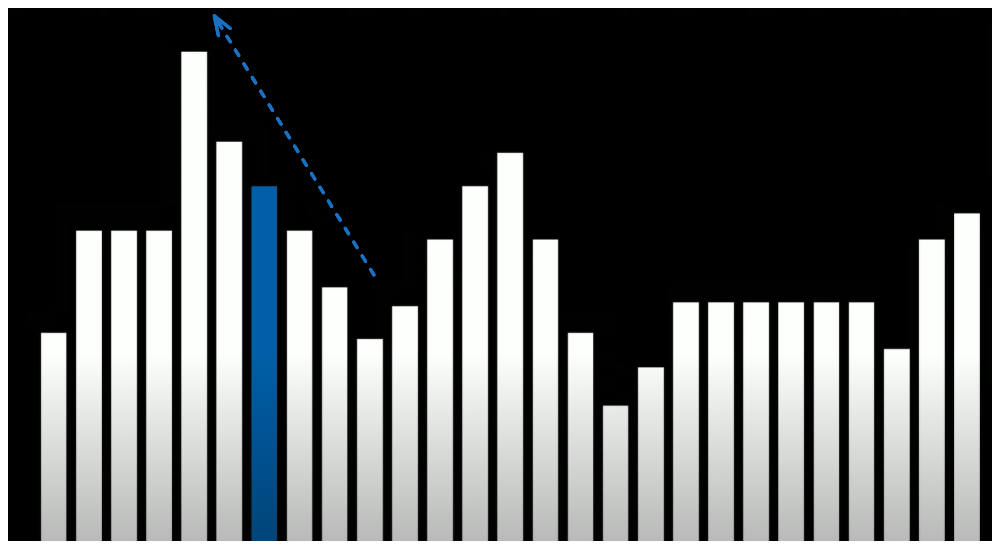
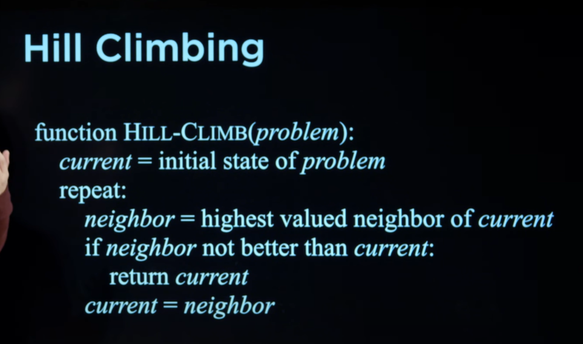
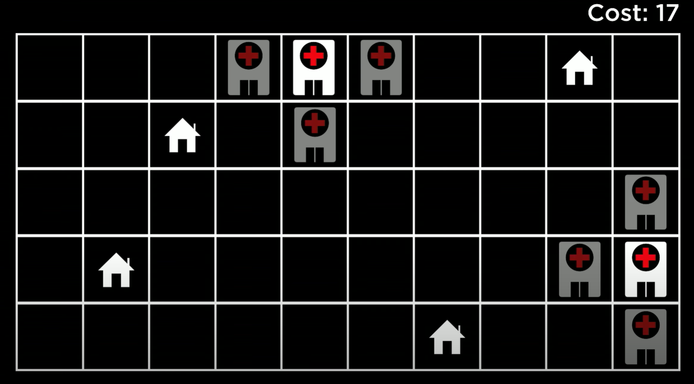
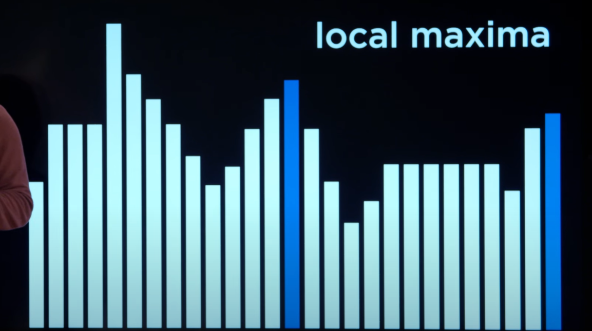

# Optimization Problems

Anteriormente estuvimos viendo modelos probabilisticos y como lidiar con hechos donde no existe absoluta certeza de que sucedan con el objetivo de crear conclusiones. En esta leccion vamos a dirigir nuestra atencion a otro tipo de problemas, por lo general reconocidos por el nombre de "optimization problems".

# Optimization

La optimizacion a grandes rasgos consiste en elegir la mejor opcion entre un abanico de posibilidades

# Local Search

Consiste en un tipo de algoritmo de busqueda que cuya estrategia se basa en el analisis / movimiento de un nodo actual hacia sus vecinos.

Local search es empleado en situaciones donde encontrar la solucion mas optima es el corazon del problema. Por ejemplo encontrar la ubicacion mas adecuada para los hospitales (donde se busca que esten lo mas cerca posible de las casas).

> Para hacer una medicion de la distancia de las casas con respecto a los hospitales utilizariamos algun tipo de funcion heuristica como la distancia de manhattan

Podemos ver este mismo problema representado de forma algo mas abstracta en un paisaje de estados.

La longitud de cada barra es calculada por una `objective function` o `cost function` en funcion de si estamos buscando maximos o minimos globales respectivamente.

Volviendo al ejemplo anterior, la funcion de coste (buscamos las barras mas cortas, los valores mas bajos) calcula la distancia de manhattan de los hospitales con respecto a las casas.

Nuestra tarea por lo tanto consiste en encontrar aquel estado que tras ser pasado por la funcion objetivo / de coste, proporciona el valor mas deseado.

> Ejemplo de espacio de estados donde buscamos mediante una funcion objetivo la barra mas grande.

Existen diferentes algoritmos para navegar inteligentemente entre nodos vecinos.

# Hill Climbing

Consiste en alternar entre nodos vecinos y avanzar en la direccion mas favorable para la funcion objetivo hasta encontrar la cuspide de una colina.

> El mismo conecpto es aplicable tambien para encontrar valles

- Establecemos el estado inicial del problema (o es proporcionado)

- Rebuscamos entre los nodos vecinos el mas favorable (ya sea que estamos buscando maximos o minimos globales)

- Comparamos el mejor nodo vecino con el actual y en caso de ser mejor, el nodo actual pasa a ser aquel nodo.

Una problema que tiene la version estandar de hill climbing es el riesgo a toparnos con un maximo / minimo local. Muchas veces para encontrar la mejor solucion al problema es necesario pasar por vecinos peores que el estado actual con el objetivo de llegar al mejor punto.

Esta version de hill climbing es conocida como `steepest-ascent`, no obstante existen variaciones.