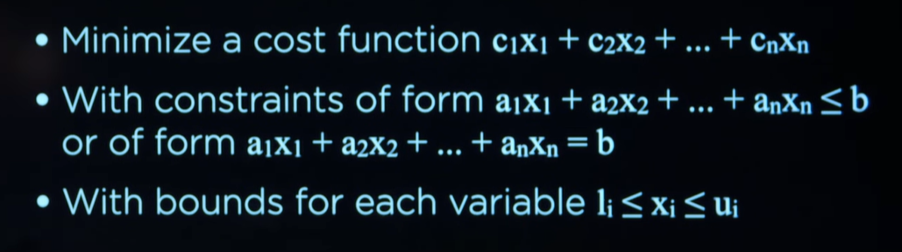

# Optimization Problems

Anteriormente estuvimos viendo modelos probabilisticos y como lidiar con hechos donde no existe absoluta certeza de que sucedan con el objetivo de crear conclusiones. En esta leccion vamos a dirigir nuestra atencion a otro tipo de problemas, por lo general reconocidos por el nombre de "optimization problems".

# Optimization

La optimizacion a grandes rasgos consiste en elegir la mejor opcion entre un abanico de posibilidades

# Local Search

Consiste en un tipo de algoritmo de busqueda que cuya estrategia se basa en el analisis / movimiento de un nodo actual hacia sus vecinos.

Local search es empleado en situaciones donde encontrar la solucion mas optima es el corazon del problema. Por ejemplo encontrar la ubicacion mas adecuada para los hospitales (donde se busca que esten lo mas cerca posible de las casas).

> Para hacer una medicion de la distancia de las casas con respecto a los hospitales utilizariamos algun tipo de funcion heuristica como la distancia de manhattan

Podemos ver este mismo problema representado de forma algo mas abstracta en un paisaje de estados.

La longitud de cada barra es calculada por una `objective function` o `cost function` en funcion de si estamos buscando maximos o minimos globales respectivamente.

Volviendo al ejemplo anterior, la funcion de coste (buscamos las barras mas cortas, los valores mas bajos) calcula la distancia de manhattan de los hospitales con respecto a las casas.

Nuestra tarea por lo tanto consiste en encontrar aquel estado que tras ser pasado por la funcion objetivo / de coste, proporciona el valor mas deseado.

> Ejemplo de espacio de estados donde buscamos mediante una funcion objetivo la barra mas grande.

Existen diferentes algoritmos para navegar inteligentemente entre nodos vecinos.

# Hill Climbing

Consiste en alternar entre nodos vecinos y avanzar en la direccion mas favorable para la funcion objetivo hasta encontrar la cuspide de una colina.

> El mismo conecpto es aplicable tambien para encontrar valles

- Establecemos el estado inicial del problema (o es proporcionado)

- Rebuscamos entre los nodos vecinos el mas favorable (ya sea que estamos buscando maximos o minimos globales)

- Comparamos el mejor nodo vecino con el actual y en caso de ser mejor, el nodo actual pasa a ser aquel nodo.

Una problema que tiene la version estandar de hill climbing es el riesgo a toparnos con un maximo / minimo local. Muchas veces para encontrar la mejor solucion al problema es necesario pasar por vecinos peores que el estado actual con el objetivo de llegar al mejor punto.

Esta version de hill climbing es conocida como `steepest-ascent`, no obstante existen variaciones.

- **Stochastic variant**: Elige un vecino con valoracion superior a la actual aleatoriamente.

- **first-choice variant**: Elige el primer vecino con mejor valoracion

- **random-restart**: Consiste en repetir uno de los anteriores multiples veces con el objetivo de conseguir valores mas precisos.

- **local beam search**: Consiste en elegir varios mejores valores, en lugar de limitarse unicamente a uno.

Todos estos algoritmos se basan en la premisa de que nunca van a elegir un estado peor que el actual, sin embargo en ocasiones para llegar a la mejor solucion es necesario sobrepasar uno o varios malos estados.

# Simulated Annealing

Se fundamenta en la varianza a lo largo del tiempo de un parametro que controla que tal tolerante a estados peores es el algoritmo. A medida que madura la busqueda, el algoritmo se hace menos tolerante a estados peores.

- Se establece el estado actual

- Itera un maximo de veces y por cada iteracion obtiene la "temperatura" actual

- Elige entre todos los vecinos uno cualquiera al azar

- Calcula que tan bueno / malo es el vecino de forma relativa al estado actual

- Si estado elegido aleatoriamente es mejor que el estado actual, el estado actual pasa a ser aquel elegido aleatoriamente; por el contrario,

- Si el estado elegido aleatoriamente es peor que el estado actual, el estado actual es el estado elegido aleatoriamente aunque con probabilidad $e^{ΔE/T}$, donde $ΔE$ es que tan mejor / peor es el estado elegido con respecto al actual y T la temperatura actual. A mas temperatura, menos tolerancia a elegir estados peores que el actual. 

# Traveling Salesman Problem

Es un famoso problema en computer scince que consiste en encontrar la forma de atravesar todos los nodos siguiendo el camino mas corto posible.

Resolver el problema es bastante costoso computacionalmente hablando, de hecho es un problema categorizado como "NP-complete problems" puesto que no existe una solucion optima al problema. Al no existir una solucion optima al problema, lo maximo que podemos hacer es encontrar aproximaciones lo mas baratas posibles en terminos de computacion.

`Local search` puede ser empleado para llegar a una conclusion aproximada. Lo primero en lo que realmente tenemos que pensar es en el concepto de estado vecino para este problema en particular. Un estado vecino podria ser un cambio de direccion de nodo a nodo. Tambien deberiamos codificar un mecanismo de medicion para el costo de cada uno de los estados -- aunque esto ultimo se alinea con la misma naturaleza de local searching.

# Linear Programming 

Consiste en una categoria de problemas donde buscamos reducir o maximizar el valor generado por una funcion matematica, tal y como si estuvieramos resolviendo incognitas en algebra lineal. Nos encontraremos con `linear programming` en escenarios con numeros reales, en lugar de valores discretos.

De acuerdo para resolver las incognitas, estableceremos restricciones lineales.

Tomemos como ejemplo el siguiente problema donde buscamos minimizar costos y maximizar la produccion.

En terminos matematicos podriamos representar esta funcion y dos restricciones de la siguiente forma (recordemos que $x_1$ corresponde al numero de horas para la primera maquina mientras que $x_2$ a la segunda)

**Cost Function**

La primera maquina cuesta USD 50$ de la USA por hora, mientras que la segunda USD 80$.

$50x_1 + 80x_2$

> Funcion de coste (en este caso estamos buscando minimizar el costo de tener ambas maquinas)

---

**Constraints**

De acuerdo para administrar el tiempo de uso de cada maquina, cada maquina tiene asignada una constante para el numero de unidades de labor que esta gasta por hora. En este caso en particular:

- La primera maquina gasta 5 unidade de trabajo por hora, mientras que

- La segunda solo 2.

No tiene sentido establecer una cantidad de unidades de trabajo en una hora por maquina si no hay un limite de unidades de trabajo que podemos consumir. En este caso el limite de unidades de trabajo son 20.

$5x_1 + 5x_2 <= 20$

Otra restriccion aplicable a este ejemplo consiste en la produccion que la compañia necesita. Cada maquina va a tener un numero determinado de unidades que esta puede fabricar en una hora.

Para este ejemplo digamos que:

- La primera maquina produce 10 unidades de un producto en una hora, mientras que

- La segunda genera 12, y;

- La compañia demanda 90 unidades

Matematicamente representable tal que

$10x_1 + 12x_2 >= 90$

