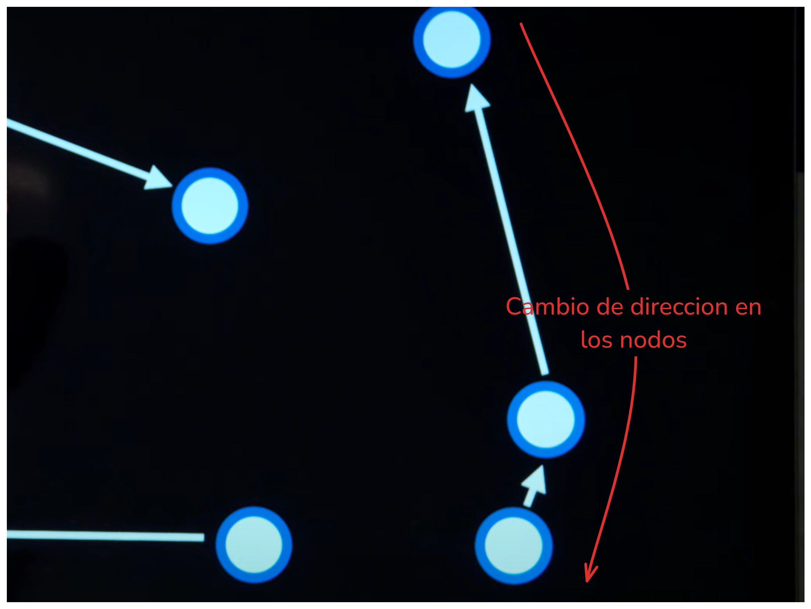

# Lecture 3 — Optimization Problems

Anteriormente estuvimos viendo modelos probabilisticos y como lidiar con hechos donde no existe absoluta certeza de que sucedan con el objetivo de crear conclusiones. En esta leccion vamos a dirigir nuestra atencion a otro tipo de problemas, por lo general reconocidos por el nombre de "optimization problems".

# Optimization

La optimizacion a grandes rasgos consiste en elegir la mejor opcion entre un abanico de posibilidades

# Local Search

Consiste en un tipo de algoritmo de busqueda que cuya estrategia se basa en el analisis / movimiento de un nodo actual hacia sus vecinos.

Local search es empleado en situaciones donde encontrar la solucion mas optima es el corazon del problema. Por ejemplo encontrar la ubicacion mas adecuada para los hospitales (donde se busca que esten lo mas cerca posible de las casas).

> Para hacer una medicion de la distancia de las casas con respecto a los hospitales utilizariamos algun tipo de funcion heuristica como la distancia de manhattan

Podemos ver este mismo problema representado de forma algo mas abstracta en un paisaje de estados.

La longitud de cada barra es calculada por una `objective function` o `cost function` en funcion de si estamos buscando maximos o minimos globales respectivamente.

Volviendo al ejemplo anterior, la funcion de coste (buscamos las barras mas cortas, los valores mas bajos) calcula la distancia de manhattan de los hospitales con respecto a las casas.

Nuestra tarea por lo tanto consiste en encontrar aquel estado que tras ser pasado por la funcion objetivo / de coste, proporciona el valor mas deseado.

> Ejemplo de espacio de estados donde buscamos mediante una funcion objetivo la barra mas grande.

Existen diferentes algoritmos para navegar inteligentemente entre nodos vecinos.

# Hill Climbing

Consiste en alternar entre nodos vecinos y avanzar en la direccion mas favorable para la funcion objetivo hasta encontrar la cuspide de una colina.

> El mismo conecpto es aplicable tambien para encontrar valles

- Establecemos el estado inicial del problema (o es proporcionado)

- Rebuscamos entre los nodos vecinos el mas favorable (ya sea que estamos buscando maximos o minimos globales)

- Comparamos el mejor nodo vecino con el actual y en caso de ser mejor, el nodo actual pasa a ser aquel nodo.

Una problema que tiene la version estandar de hill climbing es el riesgo a toparnos con un maximo / minimo local. Muchas veces para encontrar la mejor solucion al problema es necesario pasar por vecinos peores que el estado actual con el objetivo de llegar al mejor punto.

Esta version de hill climbing es conocida como `steepest-ascent`, no obstante existen variaciones.

- **Stochastic variant**: Elige un vecino con valoracion superior a la actual aleatoriamente.

- **first-choice variant**: Elige el primer vecino con mejor valoracion

- **random-restart**: Consiste en repetir uno de los anteriores multiples veces con el objetivo de conseguir valores mas precisos.

- **local beam search**: Consiste en elegir varios mejores valores, en lugar de limitarse unicamente a uno.

Todos estos algoritmos se basan en la premisa de que nunca van a elegir un estado peor que el actual, sin embargo en ocasiones para llegar a la mejor solucion es necesario sobrepasar uno o varios malos estados.

# Simulated Annealing

Se fundamenta en la varianza a lo largo del tiempo de un parametro que controla que tal tolerante a estados peores es el algoritmo. A medida que madura la busqueda, el algoritmo se hace menos tolerante a estados peores.

- Se establece el estado actual

- Itera un maximo de veces y por cada iteracion obtiene la "temperatura" actual

- Elige entre todos los vecinos uno cualquiera al azar

- Calcula que tan bueno / malo es el vecino de forma relativa al estado actual

- Si estado elegido aleatoriamente es mejor que el estado actual, el estado actual pasa a ser aquel elegido aleatoriamente; por el contrario,

- Si el estado elegido aleatoriamente es peor que el estado actual, el estado actual es el estado elegido aleatoriamente aunque con probabilidad $e^{ΔE/T}$, donde $ΔE$ es que tan mejor / peor es el estado elegido con respecto al actual y T la temperatura actual. A mas temperatura, menos tolerancia a elegir estados peores que el actual.

# Traveling Salesman Problem

Es un famoso problema en computer scince que consiste en encontrar la forma de atravesar todos los nodos siguiendo el camino mas corto posible.

Resolver el problema es bastante costoso computacionalmente hablando, de hecho es un problema categorizado como "NP-complete problems" puesto que no existe una solucion optima al problema. Al no existir una solucion optima al problema, lo maximo que podemos hacer es encontrar aproximaciones lo mas baratas posibles en terminos de computacion.

`Local search` puede ser empleado para llegar a una conclusion aproximada. Lo primero en lo que realmente tenemos que pensar es en el concepto de estado vecino para este problema en particular. Un estado vecino podria ser un cambio de direccion de nodo a nodo. Tambien deberiamos codificar un mecanismo de medicion para el costo de cada uno de los estados -- aunque esto ultimo se alinea con la misma naturaleza de local searching.

# Linear Programming

Consiste en una categoria de problemas donde buscamos optimizar una funcion matematica de coste / objetivo; tal y como si estuvieramos resolviendo incognitas en algebra lineal, en este tipo de problemas nos interesa encontrar los mejores valores de sustitucion para la funcion matematica. Nos encontraremos con `linear programming` en escenarios donde se usan numeros reales, en lugar de valores discretos.

De acuerdo para definir el problema, estableceremos restricciones lineales.

Tomemos como ejemplo el siguiente problema donde buscamos minimizar costos y maximizar la produccion.

En terminos matematicos podriamos representar esta funcion y dos restricciones de la siguiente forma (recordemos que $x_1$ corresponde al numero de horas para la primera maquina mientras que $x_2$ a la segunda)

**Cost Function**

La primera maquina cuesta USD 50$ de la USA por hora, mientras que la segunda USD 80$.

$50x_1 + 80x_2$

> Funcion de coste (en este caso estamos buscando minimizar el costo de tener ambas maquinas)

---

**Constraints**

De acuerdo para administrar el tiempo de uso de cada maquina, cada maquina tiene asignada una constante para el numero de unidades de labor que esta gasta por hora. En este caso en particular:

- La primera maquina gasta 5 unidade de trabajo por hora, mientras que

- La segunda solo 2.

No tiene sentido establecer una cantidad de unidades de trabajo en una hora por maquina si no hay un limite de unidades de trabajo que podemos consumir. En este caso el limite de unidades de trabajo son 20.

$5x_1 + 5x_2 <= 20$

Otra restriccion aplicable a este ejemplo consiste en la produccion que la compañia necesita. Cada maquina va a tener un numero determinado de unidades que esta puede fabricar en una hora.

Para este ejemplo digamos que:

- La primera maquina produce 10 unidades de un producto en una hora, mientras que

- La segunda genera 12, y;

- La compañia demanda 90 unidades

Matematicamente representable tal que

$10x_1 + 12x_2 >= 90$

En las inecuaciones de las restricciones lineales, podemos intercambiar $>=$ o por el contrario $<=$ si cambiamos la polaridad de la ecuacion en ambos lados.

> Puede ser util si queremos simplificar un problema unificando los tipos de restricciones y lidiar solo con $<=$ o $>=$.

## Linear Programming Algorithms

Hasta el momento hemos descrito este tipo de problemas donde tenemos que encontrar los valores de sustitucion que mejor se adapten (ya sea que se trate de una funcion de coste u objetivo). No obstante, algunos de los algoritmos empleados para resolver este tipo de problemas son:

- **Simplex**

- **Interior-Point**

# Constraint Satisfaction

Existe una categoria especifica de problemas basados en el cumplimiento de ciertas restricciones -- generalmente los conocemos como `constraint satisfaction problems`.

En este tipo de problemas disponemos de una cantidad determinada de variables de sustitucion, cada una de estas puede asumir un conjunto limitado de valores. Finalmente, basandonos en los valores que estas pueden asumir aplicamos restricciones (`constraints`).

El objetivo es buscar los valores correctos para encajar con todas las restricciones planteadas por el problema.

## Examples

### Students Example

Pongamos como referencia el supuesto caso de organizar fechas de examenes a un grupo de estudiantes. Para el ejemplo digamos que existen cuatro estudiantes diferentes, cada uno de los estudiantes debe hacer tres examenes de materias diferentes. Ademas, existiran tres dias habiles en los que hacer los examenes (lunes, martes y miercoles).

El objetivo es conseguir organizar la fecha de los examenes de manera que ningun estudiante tenga que hacer dos examenes el mismo dia.

> Si no es posible encajar a la perfeccion con la restriccion, nos gustaria minimizar dicha situacion en la medida de lo posible.

Hasta este momento hemos descrito el problema, aunque ¿Como podemos codificar esta idea de manera que nuestro agente pueda encontrar la solucion adecuada?

Optaremos un concepto de nodos donde cada nodo representa un examen de una materia determinada. Siguiendo con la restriccion, si el examen actual es $A$, el siguiente no puede ser $B$ porque existiria un estudiante que hace dos examens el mismo dia.

> Como ya se menciono con anterioridad, esta estructura de nodos, asi como sus restricciones (fronteras entre nodos) pueden ser graficamente representables.

Si repetieramos el mismo proceso para todas las variables (examenes), obtendriamos un `constraint graph` completo y se veria de la siguiente manera.

> Las fronteras entre nodos en definitiva representan desigualdad para los valores de las variables (los dominios para las variables serian las fechas de examenes)

En realidad podemos aplicar esta idea de encontrar la solucion a un rompecabezas siempre y cuando seamos capaces de extrapolar:

- Un sistema de `variables`, donde cada una de ellas tiene
- Un `dominio` de valores y existen una seria de
- `Restricciones` que han de ser satisfechas.

### Sudoku Game Example

Pongamos un ejemplo diferente encima de la mesa, digamos que tenemos que resolver un sudoku. De nuevo surge el conecpto de variables, dominio y restricciones.

> El dominio de valores para cada variable puede diferir, aunque en este caso todas pueden asumir los mismos valores.

## Types of Constaints

- **hard constraints** - Restricciones que tienen que ser satisfechas de acuerdo para tomar como valida una solucion a un `constraint problem`

- **soft constraints** - Expresan una preferencia entre varias posibles soluciones a un problema. Los algoritmos de resolucion de `constraint problems`que trabajan con`soft constraints` buscan obtener la solucion preferida (entiendo que buscar la solucion preferida puede ser a su vez un linear problem).

- **unitary constraint** - Restricciones que implican una unica variable ($A != Wednesday$)

- **binary constraint** - Restricciones que implican dos variables diferentes ($A != B$)

## Terms

- **node consistency** - Describe el estado o situacion de un `constraint problem` en donde todas las variables del problema son compatibles con sus `unitary constraints`; en otras palabras, sobre cada variable, su dominio de valores es compatible con las restricciones unitarias relativas a dicha variable.

De acuerdo para conseguir **node consistency** en un `constraint problem` hemos de reducir el dominio de valores para cada varible. Eliminando de los dominios aquellos valores que no satisfacen este tipo de restricciones.

> Anteriormente ambas variables presentaban el mismo dominio de valores (Monday, Tuesday and Wednesday)

- **arc consistency** - Describe el estado o situacion de un `constraint problem` en donde todas las variables satisfacen las `binary constraints` en las que estas aparecen. En otras palabras, y poniendo como ejemplo un supuesto problema en el que trabajamos solo con dos variables $X$ e $Y$, todas las restricciones binarias de $X$ (que ademas tienen que involucrar a $Y$, pues es la unica otra variable del problema) han de ser compatibles con $Y$ (esto significa que almenos 1 posible valor de $Y$ es compatible con la restriccion binaria que aplica $X$ sobre cada valor de su dominio).

> Reducimos el dominio de valores para la variable $A$ porque el valor "Wednesday" no es compatible con la restriccion binaria $A\ !=\ B$. En este caso se ve muy facil porque $B$ solo puede adoptar un valor posible tras haber convertido el problema en `node consistant` (sin embargo podria adoptar mas valores), y es que si en algun momento $B$ toma el valor "Wednesday" la restriccion binaria no se cumplira, de ahi que reduzcamos el dominio y dejemos solamente los valores que encajen con la restriccion.

## Pseudocode

### Revise Routine

A continuacion vamos a exponer la idea detras de un algoritmo para aseguar **arc consistency** en todo un **constraint problem** (lo haremos dividiendo el problema en vaias etapas).

En primer lugar definiremos una rutina $REVISE(X, Y)$ para verificar sobre el dominio de valoers de la variable $X$, cuando no hay un cumplimiento de la restriccion binaria, es decir, cuando no hay al menos un correspondiente valor $Y$ valido. Todos aquellos valores del dominio de $X$ que no tengan un correspondiente valor valido $Y$ seran eliminados del dominio de $X$.

> Si el dominio de $X$ fue reduzido, la rutina debe retornar vedadero, de lo contrario falso. El motivo por que dejamos registrado si hubo algun cambio en el dominio de la variable $X$ es porque tras eliminar un valor que esta puede asumir, estamos potencialmente dando lugar a que otras **binary constraints** (que anteriormente estaban siendo satisfechas) dejen de estar satisfechas; por lo tanto sera necesario hacer un repaso del cumplimiento de las restricciones en las que participa la variable con el nuevo dominio de posibles valores.

### AC-3

Hasta el momento podemos asegurar **arc consistency** entre dos simbolos, pero, y si queremos lograr el mismo efecto con todas las variables de un **constraint problem**. En escenarios de este utilizaremos el algoritmo AC-3 (donde por lo general emplearemos queues para guardar los pares de variables de las restricciones binarias).

A ser posible, implementaremos este algoritmo como una rutina que recibe un CSP (`constraint satisfaction problem`).

- En primer lugar introduciremos en la **queue** en forma de pares todas las conexiones entre nodos que tiene una restriccion binaria.

- A continuacion definiremos un bucle que sera ejecutado siempre y cuando haya elementos dentro de la cola y por cada iteracion extraeremos un elemento de dicha (una conexion que comprende dos nodos).

- El par de variables extraidas (de la forma $X$, $Y$) lo pasaremos por la rutina $REVISE$, intentando reducir el dominio de $XS.

- Si el dominio de $X$ fue reducido a ningun simbolo, es sinonimo de que no hay solucion al **constraint problem**

- Por el contrario, es decir, si tras reducir el dominio, sigue habiendo valores disponibles, revalidaremos todas las restricciones binarias que involucren a la variable cuyo dominio fue reducido. Esto lo haremos agregando las correspondientes conexiones de nodos a la cola.

## The Big Problem with AC-3

El problema al momento de intentar resolver un **constraint poblem** con algoritmos como AC-3, es que estos se sustentan sobre llamadas a $REVISE(X, Y)$, es decir, en el fondo estamos verificando restricciones binarias donde participan solo dos nodos. **Si bien AC-3 se comporta realmente bien reduciendo los dominios de las variables**, a pesar de revalidar las restricciones tras una actualizacion en el domino de una variable, **AC-3 no siempre dara con una solucion al problema**.

## Searching for Solutions

De acuerdo para encontrar una solucion al problema tendremos que emplear un algoritmo de busqueda (tal y como revisamos en la primera leccion).

- **initial state**: El estado del problema consistira en una estructua de datos que enlaza nombres de variables con posibles valores que estas pueden asumir (confecciona los dominios de las variables). No obstante el estado inicial del problema no contrendra ninguna variable.

- **actions**: De acuerdo para desbloquear una nueva accion que podamos hacer dado el estado actual, podemos empujar un nuevo par de la forma $variable\ =\ value$ al estado.

- **transaction model**: Muestra el efecto de cada una de las acciones (donde podemos elegir entre una variedad de pares de la forma $variable\ =\ value$) sobre el conjunto de pares (estado actual). Por cada accion que tomemos, los dominios de las variables tenderan a estrecharse.

- **goal test**: Verifica el cumplimiento de todas las restricciones sobre el conjunto de pares del estado actual.

- **path cost function**: La funcion de coste en este caso no deberia de favorecer a ningun nodo estado en particular.

El problema de encontrar una solucion a un `csp` mediante un algoritmo de busqueda que emplee DFS o BFS es la ineficiencia. En realidad realidad podriamos aprovecharnos de la naturaleza de los `csp` para implementar un algoritmo de busqueda mejor adaptado y mas eficiente.

> Un ejemplo de una posible optimizacion seria el orden de los pares dentro de la estructura del estado. Este no importa como sea analizado, es decir $\ A=2\ B=8\ ==\ B=8\ A=2$. Cualquier algoritmo que no aplique esta optimizacion para los problemas de satisfaccion de restricciones seran ineficientes.

## Backtracking Seach

Consiste en un algoritmo de busqueda recursivo que analiza todas las combinaciones posibles en forma de arbol que un `csp` puede tener.

Gracias a backtracking search podemos resolver un `csp` descartando recursivamente aquellas ramas del arbol que no satisfagan las restricciones del problema.

El algoritmo recibira dos argumentos:

- **Assigment**: Estructura de datos que contiene las variables del `csp`, asi como los valores que cada una de estas puede tener (que satisfagan las restricciones del `csp`).

  - A lo lago de la ejecucion del algoritmo recursivo, el **assignment** sera modificado agregando / eliminando nuevos pares $vaiable\ +\ valor$, descartando las ramas de posibilidades que en algun momento impidan la satisfaccion de las restricciones del problema y buscando encontrar la solucion (la forma de rellenar **assignment** compliendo todas las restricciones)

- **Constraint Satisfacion Problem (CSP)**: Contiene todas las variables del problema, asi como sus dominios de valores y restricciones.

> Consideraremos que un **assignment** es _completo_ si contiene la totalidad de las variables del problema asociadas a un valor y sin romper la satisfaccion de algunas de las restricciones del `csp`.

Podemos definir el procedimiento de este algoritmo de la siguiente forma:

- Recibimos el **assignment** y una estructura con el `csp`

- Elegimos una variable del `csp` que no este configurada

- Obtenemos todos los valores para esa variable dentro del dominio.

  - Sobre cada valor, verificamos si existe consitencia dentro del **assignment**.

  > Mediante AC-3 y un algoritmo encargado de verificar todas las restricciones unitarias

  Si es consistente se añade al **assignment** y volvemos a ejecutar recursivamente el algoritmo `backtrack`.

  > Aunque ahora el **assignment** es diferente y por lo anto los valores de una variable del `csp` no configurada en el **assignment** generara respuestas diferentes a la pregunta:

  _"Es el valor de la varible consistente con el assignment actual ?"_

  Si la llamada recursiva a `backtrack` NO retorna un fallo (en otras palabras: en toda la pila de llamadas recursivas relativas a la rama del arbol de posibilidades actualmente seleccionado no se encuentra ninguna fallo de consistencia y por lo tanto en dicha rama existe una combinacion de valores para las variables del `csp` que que no irrumpen las restricciones del problema), consideraremos el valor proporcionado a `backtrack` como valido a la rama actual.

  > De lo contrario, si.

En definitiva, este algoritmo verifica consistencia para todas las variables de un `csp` encontrando un camino de conexiones entre ramas en todo el arbol de posibilidades que reprenseta un **assignment**.

Suponiendo que las variables tengan dominios de mismo tamaño, podemos representar matematicamente el numero de combinaciones o ramas posibles que un assignment puede tener (dado el numero de variables y tamaño de sus dominios)

$d^n\ +\ d^{n-1}\ +\ d^{n-2}\ +\ ...\ +\ d^{n-n}$

- Donde $d$ es el tamaño de los dominios para las variables, y

- $n$ representa un campo finito que puede asuir los valores 0...n haciendo referencia al numero de variables aun sin elegir su valor.

## Inference

De acuerdo para optimizar todavia mas el algoritmo, emplearemos el concepto de inferencia que vimos con anterioridad. Emplearemos la informacion conocida para crear nuevas concluisones de manera inteligente.

- Obtenemos todos las variables definidas en el **assignment** que participen en una restriccion binaria junto con otra variable no encontrada en el **assignment** (por ejemplo $C$).

- Tras tomar todos esos valores, podemos guardarlos en un set y hacer una resta de conjuntos sobre el dominio de valores permitidos.

- Si tras la diferencia de conjuntos obtenemos que solamente queda un valor disponible para ser elegido, lo tomaremos como una inferencia valida.

- Una inferencia puede dar lugar a otra. Bajo este mismo principio, y buscando constantemente nuevas inferencias podemos evitar hacer backtrack (aunque eventualmente no encontraremos inferencias y tendremos que seguir "arriesgando" con backtrack)

### Maintaining Arc-Consistency

De eso se trata precisamente el concepto de mantenimiento de consistencia arc. Por cada vez que rellenamos el **assignment** (ya sea por exploracion con `backtrack` o por inferencia) vamos a intentar hacer cumplir consistencia.

Para aplicar esta idea de buscar inferencias por cada **assignment** que es introducido, tenemos que modificar ligeramente el algoritmo de `backtrack` .

## Other Heuristics in Backtrack

### Select-Unassigned-Var

De acuerdo para optimizar todavia mas este algoritmo, podemos emplear heuristicas al momento de seleccionar las variables que vamos a intentar introducir en el **assignment** (en lugar de elegir una variable del `csp` que no se encuentre en el **assignment** de manera aleatoria).

Alguna heuristica que podemos aplicar es

- **minimum remaining values (MRV)**: Selecciona la variable que tiene dominio mas bajo (menor numero de valores para elegir). Cabe destacar que cuando hablamos de variable con dominio mas bajo, estamos hablando de dominio mas bajo tras calcular todas las posibles inferencias.

- **degree heuristic**: Selecciona la variable con mayor grado (donde el grado es el numero de nodos conectados o desde un punto de vista mas abstracto, el numero de restricciones binarias donde dicha variable esta impliicada)

Para selecionar la siguiente variable mas optima para introducir en el **assignment**:

- En primer lugar nos decantaremos por la variable con el dominio mas pequeño (es posible que obtengamos varios dominios de mismo tamaño)

- Para elegir entre varias variables con dominios de mismo tamaño, optaremos por hacer un calculo heuristico con `degree heuristic`.

### Domain-Values

Otra heuristica que podemos aplicar consiste en ordenar probabilisticamente los valores del dominio de una variable, de tal manera que aquellos valores con mayor probabilidad de ser los correctos aparezcan primero.

Para evaluar cual de los valores del dominio es mas probable, haremos uso de la heuristica de `least-constraining values`; esta consiste en ordenar ascendentemente los valores por numero de opciones que son descartadas en los dominios de variables vecinas (valores mas restrictivos).

- Ante todo vamos a buscar los valores que impliquen restricciones mas livianas. Cuanto menos restrictivo sea un valor, mas necesario sera explorar los dominios de otras variables (pues nos estamos comprometiendo menos a llegar a un estado terminal). A menos restrictivo el valor, menor compromision para llegar a un estado terminal, mayor numero de "caminos" por explorar (dominios mas grandes), mayor probabilidad de ser un camino con una solucion.

# Lection Sumary

En definitiva en esta leccion buscamos optimizar problemas de busqueda empleando conceptos vistos con anterioridad como la inferencia y probabilidad.

Hemos visto tres categorias de algoritmos diferentes para resolver este tipo de problemas. Cada una de ellas se ajusta mejor a problemas con caracteristicas particulares.

- **Local Seach**: Hemos de codificar una nocion de nodos o estados vecinos. El objetivo es obtener el nodo o estado con mejor valor en la funcion objetivo o de coste. Para maximizar o minimizar este resultado, emplearemos algoritmos para movernos inteligentemente por el espacio de estados.

  - La clave de este algoritmo esta en la heuristica empleada para moverse inteligentemente de nodo a nodo, en lugar de revisar el espacio de estados por completo y de forma ingenua.

- **Linear Programming**: Los problemas son planteados como ecuaciones lineales. La funcion objetivo o de coste asume forma matematica.

  - Para calcular el valor de la funcion objetico / de coste, una serie de coheficientes o variables de sustitucion han de ser provistos.
    - Tal y como sucedia con anteriodidad, el objetivo es maximizar o minimizar el valor obtenido por la funcion.
  - A todo esto se suma el concepto de restricciones lineales. Hablamos de inecuaciones matematicas que toman ciertos coheficientes y que han de cumplirse de acuerdo para dar una solucion al problema considerada como valida.

- **Constraint Satisfaction**: Proporciona soluciones a problemas con planteamientos mas cerrados cuyo estado terminal es binario (existe o deja de existir una solucion valida).
  - Hemos de codificar una nocion de variable con un dominio de posibles valores.
  - En definitiva consiste en dar con una combinacion de valores para las variables y que todas las restricciones sean satisfechas.
