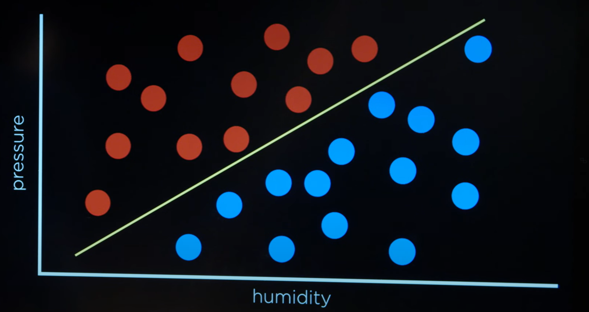

# Lecture 4 — Machine Learning

A lo largo de este curso hemos etado viendo como dar instrucciones a un agente de IA para dar dar soluciones de a problemas como punto de entrada.

En esta leccion vamos a estar explorando la idea de `machine learning`, donde en lugar de codificar un agente mediante instrucciones explicitas, nuestro agente va a tomar sus propias decisiones basandose en una determinada informacion, patrones, etc.

El concepto de `machine laerning` es muy amplio, en primer lugar revisaremos algunos de los conceptos fundadores detras de este campo.

# Supervised Learning

Dado un conjunto de datos de entrenamiento, donde se asocia un valor/es de entrada a un valor de salida en forma de par, `supervised learning` consiste en enseñar / entrenar un modelo de prediccion sobre la salida generada para una nueva entrada nunca vista y por lo tanto no presente en los datos de entrenamiento para tal modelo.

# Classification

Consiste en la tarea de clasificar el valor de salida predecido por un modelo previamente entrenado. En otras palabras, dados los datos de entrada provistos al modelo, analizaremos la salida y sacaremos conclusiones sobre cual es el nombre de clase adecuado para dicha entrada (posteriormente materializaremos el concepto de clasificacion mas / menos acertada).

De manera introductoria a este concepto de clasificacion y de acuerdo para simplificar las ideas, tendremos en cuenta escenarios de clasificacion binarios (los valores de entrada han de ser clasificados de acuerdo a dos posibles etiquetas)

### Examples of Binary Clasification Problems

- **Billetes** — Buscamos averiguar la autenticidad de un billete. Podriamos clasificar el billete como "falso" o "verdadero" (al haber una cantidad limitada de clases, estamos hablando de valores discretos)

- **Meteorologia** — Tal y como estuvimos viendo en las anteriores lecciones, de manera semejante a los modelos probabilisticos (digase supuestos de markov y tal vez modelos sensor), hay un trabajo de inferencia dadas unas observaciones. A traves de una serie de **patrones implicitos en los datos provistos**, un algoritmo de clasificacion es capaz de etiquetar ciertos escenarios.

O... lo que es igual — aunque desde una perspectiva mas matematica:

## Plots

Realmente no sabemos a ciencia cierta la salida de la funcion $f(...)$, pero si podemos generar un resultado estimado con una funcion $h(...)$.

Una forma razonable en la que podriamos ver los datos de entrenamiento para un modelo asi como las clasificaciones arrojadas por el mismo (especialmente si estamos hablando de funciones clasificadoras bidimensionales), seria a traves de un grafico o plot. Decimos que una tarea de clasificacion presenta $n$ dimensiones, siendo cada dimensio un valor de entrada para la funcion $h(...)$.

En el anterior ejemplo de prediccion meteorologica, dos valores de entrada diferentes (humedad y presion) eran pasados a la tarea de clasificacion.

- **Rojo** — Dias sin lluvia

- **Azul** — Dias con lluvia

> El objetivo de la tarea clasificatoria por lo tanto consiste en, dado un nuevo punto en el grafico (no existente en el grafico en ese momento), ser capaz de clasificarlo (llueve o no llueve).

Por pura intuicion, podriamos decir que el punto azul claro debe ser clasificado como un dia lluvioso — lo cual es una nocion poco formal y que posteriormente profundizaremos mas.

## Classification techniques

- **neighbouring data points classification algorithms**:

  Hasta el momento hemos visto la clasificacion desde una perspectiva en el calculo de **regresion lineal** (dot product) y por lo tanto en algoritmos de clasificacion como **regresion logistica** (mas adelante veremos en detalles como funcionan). Sin embargo, cabe destacar que existen otros dos mecanismos que toman un enfoque diferente y algo mas simplificado.

  - **neaest-neighbour** — La funcion de clasificacion etiqueta la entrada de la misma forma que lo hizo el `data point` mas cercano (valores de entrada mas parecidos).

  - **$k$-nearest-neighbour** — En ocasiones es demasiado determinante generar una clasificacion fijandonos solamente en un `data point`, por eso mismo, esta variante tiene en cuenta $k$ nodos mas cercanos.

    > Probablemente el mas indicado de los dos a emplear en el problema de clasificacion meteorologica.

  Segun vayamos descubriendo nuevos algoritmos clasificatorios en este campo del aprendizaje automatico y vayamos topandonos con nuevos problemas, se reforzara la idea que ciertos algoritmos se desenvolveran mejor ante ciertas situacion en comporacion con otros y viceversa.

- **linear regression based clasification algorithms**:

  Si bien podemos emplear ciertos razonamientos / heuristicas para obtener el valor mas optimo de $k$, asi como los nodos vecinos mas determinantes y podar aquellos que solamente suponen un lastre computacional, podemos cambiar de enfoque integralmente al momento de clasificar los `data entry` en el plot.

  En el mismo grafico bidimensional donde se toman los valores para la presion y humedad (dos dimensiones / parametros) podemos dibujar un limite que separa los dias de lluvia de los dias sin lluvia.

  

  Aunque por lo general nuestra linea delimitadora no sera tan buena y siempre cometera algun error:

  

  ### Graphical Explanation Aside

      - Las presentes representaciones graficas tratan de explicar el concepto de clasificacion desde la perspectiva de un `data point` en un lado u otro de la linea (como la posicion en el espacio bidimensional para dicha entrada termina repercutiendo en su nombre de clase); sin embargo, no es necesariamente aplicable al concepto de `linear regression`.

      - La regresion lineal da lugar a la prediccion de valores numericos continuos y estos han de ser clasificados mediante algoritmos oportunos, tales como `logical regression`.

      - La regresion logistica da cabida a clasificacion por probabilidades; sin embargo, tal y como muestran tales representaciones graficas, solamente estamos verificando si el `data point` se encuentra a un lado u otro de la linea.

      - Por todo este razonamiento es por el que podemos concluir que, probablemente la forma mas adecuada de categorizar este metodo de clasificacion segun las imagenes es: como un algoritmo de `support vector machines` (SVM) donde dicha linea delimitadora busca maximizar el espacio entre los soportes vectoriales (los nodos de cada clasificacion mas cercanos a la linea).

## Implement Liner Regression

Podemos ver `linear regression` desde una perspectiva mas matematica. Digamos que vamos a darle un nombre a cada uno de los parametros de nuestra `hypothesis function` $h$:

- $x_1$ — Humedity

- $x_2$ — Pressure

El objetivo de $h$ por lo tanto, consiste en obtener un valor de salida desde ambos parametros de entrara para posteriormente ser clasificado.

Crearemos una combinacion lineal de ambos parametros de entrada con un peso $w_n$, siendo este proporcional a la relevancia de cada uno de estos parametros para lograr el resultado.

Rain if $\ \ \ \ w_0 + x_1w_1 + x_2w_2\ >=\ 0\\$
No Rain $\ \ otherwise$

Los pesos $w$ son constantes y su valor es determinante; pues los valores de salida arrojados seran clasificados posteriormente. Por este motivo el vector de pesos ha de estar meticulosamente entrenado.

Por lo general (especialmente cuando hablamos de tareas de clasificacion con cientos o miles de parametros) las representaciones matematicas de este concepto se llevan a cabo con vectores.

- Weights (**W**) — $<w_0, w_1, w_2>$

- Inputs (**X**) — $<1, x_1, x_2>$

Calcularemos el `dot product` entre ambos vectores:

**W · X** $\ =\ (w_0 * 1) + (w_1 * x_1) + (w_2 * x_2)$

De la misma forma que hicimos antes, simplemente habria que verificar si **W · X** es mayor o menor que $0$ (simplemente es otra forma de representar matematicamente la misma idea).

> El motivo por el que el vector `inputs` comienza por $1$, es porque para poder hacer la multiplicacion de vectores necesitamos que sean de la misma longitud. $w_0$ lo empleamos como un valor esporadico de desplazamiento.

Por ultimo tambien cabe destacar que para codificar cada una de las clasificaciones, es muy comun emplear numeros enteros

- Rain — $1$

- No Rain — $0$

En este caso estamos empleando regresion lineal como base a probablemente el metodo de clasificacion mas sencillo que podemos utilizar. Simplemente verificamos si el `dot product` entre el vector de los `inputs` y el de los `weights` sobrebasa un limite fijo establecido ($0$ en este caso), en cuyo caso consideramos que es un dia lluvioso (esto es lo que conocemos como hard threshold).

### Perceptron Learning Rule

Hasta el momento hemos estado dando por hecho que disponemos del vector **W** con los pesos ya ponderados. A continuacion cubriremos a grandes rasgos esta regla de aprendizaje para ajustar el vector de pesos de la forma mas precisa posible.

- Iteraremos por cada valor en los vectores `inputs` y `weights`

- El _valor de peso_ de la iteracion actual sera desplazado en el producto de:

  - El _valor de input_ de la iteracion actual; y

  - El _ratio de aprendizaje_ de:

    - La diferencia del _valor real_ frente al _valor estimado_

---

- _valor de peso_ — $w_n$

- _valor de input_ — $x_n$

- _ratio de aprendizaje_ — $ɑ$

- _valor real_ — $y$ — valor asociado a data point **X** en datos de entrenamiento del modelo

- _valor estimado_ — $h_w($**X**$)$

> Para _valor real_ y _valor estimado_ es fundamental que que las clasificaciones esten asociadas a un valor numerico, de tal manera que podemos calcular la diferencia.

Actualmente estamos planteando la clasificacion con un limite muy agresivo (llueve si **W**$\ *\ $**X**$\ >=\ 0$). Esto es lo que se conoce como `hard threshold` y su representacion grafica se ve de la siguiente manera:

Este metodo es simple de aplicar aunque tiene ciertas limitaciones en:

- Escalabilidad (derivaciones en la curva)

- Graduabilidad (no hay probabilidades; blanco o negro)

Verdaderos algoritmos de  clasificacion como `logical regression` permiten limites suaves o `soft threholds`; estos dan la posibilidad de graduacion entre las clasificaciones (valores en forma de numeros reales), dondo entrada al concepto de probabilidad.

