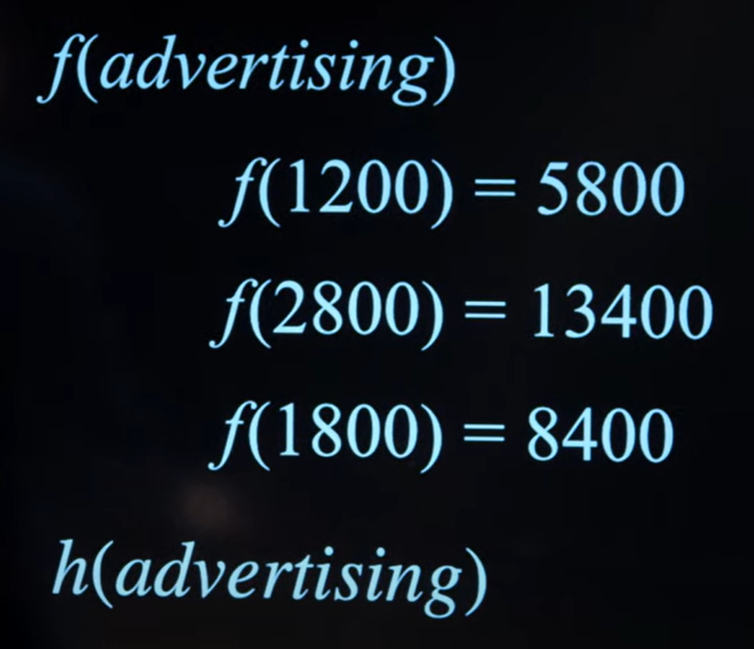

# Lecture 4 — Machine Learning

A lo largo de este curso hemos etado viendo como dar instrucciones a un agente de IA para dar dar soluciones de a problemas como punto de entrada.

En esta leccion vamos a estar explorando la idea de `machine learning`, donde en lugar de codificar un agente mediante instrucciones explicitas, nuestro agente va a tomar sus propias decisiones basandose en una determinada informacion, patrones, etc.

El concepto de `machine laerning` es muy amplio, en primer lugar revisaremos algunos de los conceptos fundadores detras de este campo.

# Supervised Learning

Dado un conjunto de datos de entrenamiento, donde se asocia un valor/es de entrada a un valor de salida en forma de par, `supervised learning` consiste en enseñar / entrenar un modelo de prediccion sobre la salida generada para una nueva entrada nunca vista y por lo tanto no presente en los datos de entrenamiento para tal modelo.

A continuacion revisaremos algunas **tareas con las que nos podemos topar** en `supervised learning` ...

# Classification

Consiste en la tarea de clasificar el valor de salida predicho por un modelo previamente entrenado. En otras palabras, dados los datos de entrada provistos al modelo, analizaremos la salida y sacaremos conclusiones sobre cual es el nombre de clase adecuado para dicha entrada (posteriormente materializaremos el concepto de clasificacion mas / menos acertada).

De manera introductoria a este concepto de clasificacion y de acuerdo para simplificar las ideas, tendremos en cuenta escenarios de clasificacion binarios (los valores de entrada han de ser clasificados de acuerdo a dos posibles etiquetas)

### Examples of Binary Clasification Problems

- **Billetes** — Buscamos averiguar la autenticidad de un billete. Podriamos clasificar el billete como "falso" o "verdadero" (al haber una cantidad limitada de clases, estamos hablando de valores discretos)

- **Meteorologia** — Tal y como estuvimos viendo en las anteriores lecciones, de manera semejante a los modelos probabilisticos (digase supuestos de markov y tal vez modelos sensor), hay un trabajo de inferencia dadas unas observaciones. A traves de una serie de **patrones implicitos en los datos provistos**, un algoritmo de clasificacion es capaz de etiquetar ciertos escenarios.

O... lo que es igual — aunque desde una perspectiva mas matematica:

## Plots

Realmente no sabemos a ciencia cierta la salida de la funcion $f(...)$, pero si podemos generar un resultado estimado con una funcion $h(...)$.

Una forma razonable en la que podriamos ver los datos de entrenamiento para un modelo asi como las clasificaciones arrojadas por el mismo (especialmente si estamos hablando de funciones clasificadoras bidimensionales), seria a traves de un grafico o plot. Decimos que una tarea de clasificacion presenta $n$ dimensiones, siendo cada dimensio un valor de entrada para la funcion $h(...)$.

En el anterior ejemplo de prediccion meteorologica, dos valores de entrada diferentes (humedad y presion) eran pasados a la tarea de clasificacion.

- **Rojo** — Dias sin lluvia

- **Azul** — Dias con lluvia

> El objetivo de la tarea clasificatoria por lo tanto consiste en, dado un nuevo punto en el grafico (no existente en el grafico en ese momento), ser capaz de clasificarlo (llueve o no llueve).

Por pura intuicion, podriamos decir que el punto azul claro debe ser clasificado como un dia lluvioso — lo cual es una nocion poco formal y que posteriormente profundizaremos mas.

## Classification techniques

- **neighbouring data points classification algorithms**:

  Hasta el momento hemos visto la clasificacion desde una perspectiva en el calculo de **regresion lineal** (dot product) y por lo tanto en algoritmos de clasificacion como **regresion logistica** (mas adelante veremos en detalles como funcionan). Sin embargo, cabe destacar que existen otros dos mecanismos que toman un enfoque diferente y algo mas simplificado.

  - **neaest-neighbour** — La funcion de clasificacion etiqueta la entrada de la misma forma que lo hizo el `data point` mas cercano (valores de entrada mas parecidos).

  - **$k$-nearest-neighbour** — En ocasiones es demasiado determinante generar una clasificacion fijandonos solamente en un `data point`, por eso mismo, esta variante tiene en cuenta $k$ nodos mas cercanos.

    > Probablemente el mas indicado de los dos a emplear en el problema de clasificacion meteorologica.

  Segun vayamos descubriendo nuevos algoritmos clasificatorios en este campo del aprendizaje automatico y vayamos topandonos con nuevos problemas, se reforzara la idea que ciertos algoritmos se desenvolveran mejor ante ciertas situacion en comporacion con otros y viceversa.

- **linear regression based clasification algorithms**:

  Si bien podemos emplear ciertos razonamientos / heuristicas para obtener el valor mas optimo de $k$, asi como los nodos vecinos mas determinantes y podar aquellos que solamente suponen un lastre computacional, podemos cambiar de enfoque integralmente al momento de clasificar los `data entry` en el plot.

  En el mismo grafico bidimensional donde se toman los valores para la presion y humedad (dos dimensiones / parametros) podemos dibujar un limite que separa los dias de lluvia de los dias sin lluvia.

  

  Aunque por lo general nuestra linea delimitadora no sera tan buena y siempre cometera algun error:

  

  ### Graphical Explanation Aside

      - Las presentes representaciones graficas tratan de explicar el concepto de prediccion de una clasificacion desde la perspectiva de un `data point` en un lado u otro de la linea (como la posicion en el espacio bidimensional para dicha entrada termina repercutiendo en su nombre de clase); sin embargo, no es necesariamente aplicable al concepto de `linear regression`.

      - La regresion lineal da lugar a la prediccion de valores numericos continuos, no la de clases. Estos valores numericos han de ser clasificados mediante algoritmos oportunos, tales como `logical regression` o `softmax regression` si se busca un enfoque multiclase.

      - Por todo este razonamiento es por el que podemos concluir que, probablemente la forma mas adecuada de categorizar este metodo de clasificacion segun las imagenes es: como un algoritmo de `support vector machines` (SVM) donde dicha linea delimitadora busca maximizar el espacio entre los soportes vectoriales (los puntos de datos de cada clasificacion mas cercanos a la linea).

## Implement Liner Regression

Podemos ver `linear regression` desde una perspectiva mas matematica. Digamos que vamos a darle un nombre a cada uno de los parametros de nuestra `hypothesis function` $h$:

- $x_1$ — Humedity

- $x_2$ — Pressure

El objetivo de $h$ por lo tanto, consiste en obtener un valor de salida desde ambos parametros de entrara para posteriormente ser clasificado.

Crearemos una combinacion lineal de ambos parametros de entrada con un peso $w_n$, siendo este proporcional a la relevancia de cada uno de estos parametros para lograr el resultado.

Rain if $\ \ \ \ w_0 + x_1w_1 + x_2w_2\ >=\ 0\\$
No Rain $\ \ otherwise$

> $>= 0$ es probablemente el metodo de clasificacion mas simple que podemos emplear (proximamente exploraremos metodos de clasificacion mas sofisticados, ya sea basados o no en regresion lineal).

Los pesos $w$ son constantes y su valor es determinante; pues los valores de salida arrojados seran clasificados posteriormente. Por este motivo el vector de pesos ha de estar meticulosamente entrenado.

Por lo general (especialmente cuando hablamos de tareas de clasificacion con cientos o miles de parametros) las representaciones matematicas de este concepto se llevan a cabo con vectores.

- Weights (**W**) — $<w_0, w_1, w_2>$

- Inputs (**X**) — $<1, x_1, x_2>$

Calcularemos el `dot product` entre ambos vectores:

**W · X** $\ =\ (w_0 * 1) + (w_1 * x_1) + (w_2 * x_2)$

De la misma forma que hicimos antes, simplemente habria que verificar si **W · X** es mayor o menor que $0$ (simplemente es otra forma de representar matematicamente la misma idea).

> El motivo por el que el vector `inputs` comienza por $1$, es porque para poder hacer la multiplicacion de vectores necesitamos que sean de la misma longitud. $w_0$ lo empleamos como un valor esporadico de desplazamiento.

Por ultimo tambien cabe destacar que para codificar cada una de las clasificaciones, es muy comun emplear numeros enteros

- Rain — $1$

- No Rain — $0$

En este caso estamos empleando regresion lineal como base a probablemente el metodo de clasificacion mas sencillo que podemos utilizar. Simplemente verificamos si el `dot product` entre el vector de los `inputs` y el de los `weights` sobrebasa un limite fijo establecido ($0$ en este caso), en cuyo caso consideramos que es un dia lluvioso (esto es lo que conocemos como hard threshold).

### Perceptron Learning Rule

Hasta el momento hemos estado dando por hecho que disponemos del vector **W** con los pesos ya ponderados. A continuacion cubriremos a grandes rasgos esta regla de aprendizaje para ajustar el vector de pesos de la forma mas precisa posible.

- Iteraremos por cada valor en los vectores `inputs` y `weights`

- El _valor de peso_ de la iteracion actual sera desplazado en el producto de:

  - El _valor de input_ de la iteracion actual; y

  - El _ratio de aprendizaje_ de:

    - La diferencia del _valor real_ frente al _valor estimado_

---

- _valor de peso_ — $w_n$

- _valor de input_ — $x_n$

- _ratio de aprendizaje_ — $ɑ$

- _valor real_ — $y$ — valor asociado a data point **X** en datos de entrenamiento del modelo

- _valor estimado_ — $h_w($**X**$)$

> Para _valor real_ y _valor estimado_ es fundamental que que las clasificaciones esten asociadas a un valor numerico, de tal manera que podemos calcular la diferencia.

## Classify with Linear Regression

Actualmente estamos planteando la clasificacion desde la perspectiva de:

- Hard tresholds (limites no progresivos)

- Solo dos clases (llueve o no llueve)

> **W**$\ *\ $**X**$\ >=\ 0$

Este metodo es simple de aplicar aunque tiene ciertas limitaciones en:

- Escalabilidad (derivaciones en la curva)

- Graduabilidad (no hay probabilidades; blanco o negro)

Verdaderos algoritmos de clasificacion como `logical regression` permiten limites suaves o `soft threholds`; estos dan la posibilidad de graduacion entre las clasificaciones (valores en forma de numeros reales), dondo entrada al concepto de probabilidad.

Por otra parte, para menajar escenarios multiclase donde tal vez podemos clasificar los puntos de datos de cientos de formas, existen otros algoritmos como `softmax regression` o `one-vs-rest`.

## Support Vector Machines

Consiste en un algoritmo de clasificacion basado en la definicion de lineas delimitadoras en el espacio de $n$ dimensiones.

> Es importante no confundirlo con algoritmos de clasificacion basados en regresion lineal. Aqui no estamos clasificando el `dot product` entre un vector de datos de entrada y un vector de pesos; en su lugar estamos definiendo una linea en el espacio con posicion e inclinacion estrategicas con el objetivo de separar las entradas de datos. Estamos detectando un patron de comportamiento entre las clasificaciones pues estas tienen una tendencia a ubicarse de una determinada manera en el espacio, no es pura entropia.

Aqui tenemos un ejemplo grafico de una linea delimitadora poco precisa generada por una maquina de soporte vectorial.

Al momento de clasificar, realmente dicha linea va hacer bien el trabajo siempre y cuando no proporcionemos datos nuevos; es decir, datos no incluidos como parte del entrenamiento del modelo que la ha generado.

Los problemas al momento de predecir clasificaciones mas bien comienzan cuando entregamos al modelo datos de entrada nunca vistos; en otras palabras, el modelo no ha calibrado correctamente la linea delimitadora.

Tal vez aquellos nuevos puntos de datos tendrian que haber sido clasificados en rojo, aunque en este caso por un fallo de precision en la linea delimitadora, son considerados como azul.

Con todo esto llegamos a la conclusion de que el objetivo y al fin y al cabo la calidad de un algoritmo de maquina de soporte de vectores radica en lo que conocemos como `maximum margin separator`.

Incluyendo el mayor margen posible entre los soportes vectoriales (puntos de datos de cada clasificacion mas cercanos a la linea) conseguimos generalizar los escenarios y evitar descompensaciones en la clasificacion.

Como bien hemos mencionado con anterioridad, este algoritmo de clasificacion no es solo aplicable a planos de dos dimensiones, tambien es aplicable a un hiperplano de $n$ dimensiones.

`SVM` es ideal en escenarios donde trabajamos con datos linealmente no separables gracias a [mecanismos como los kernels](https://codatalicious.medium.com/kernels-ee967067aa9).

# Regression

Se trata de otra tarea con la que podriamos llegar a toparnos en `supervised learning` y consiste en asociar un punto de entrada de datos a un valor numerico continuo como salida. Se diferencia con respecto a una tarea de clasificacion en que no buscamos predecir categorias discretas (llueve o no llueve), en su lugar, y por lo general, predecimos valores numericos.

Como ejemplo podemos pensar en una compañia que quiere maximizar sus ventas y conocer un valor estimado sobre como repercute en sus ventas el gasto en publicidad.

Tal y como se ha comentado anteriormente, la regresion lineal es un mecanismo predictivo para valores numericos. Por tanto y demas, para generar tal estimacion sobre las ventas (dado el gasto en publicidad), podemos seguir un enfoque de regresion lineal con vectores de pesos entrenados $w_n$ por medio de tecnicas como `perceptron learning rule`.

En las representaciones graficas bidimensionales de regresion, la linea trazada, en el fondo es generada por un vector de pares $x,y$; donde $x$ es el valor de entrada para $h_w$ e $y$ el valor predicho / su salida (advertising, sales).

# Evaluating Hypothesis

Hasta el momento hemos estado viendo como generar hipotesis mediante diferentes algoritmos en aprendizaje automatico; sin embargo, no sabemos a ciencia cierta que tan buenas son estas predicciones.

## Loss Function

Consiste en un mecanismo para expresar que tan "pobres" son las predicciones generadas por nuestra funcion de hipotesis $h$.

> Codificar una buena funcion de perdida es fundamental para un posterior ejercicio de minimizacion sobre nuestra funcion de prediccion.

Existen multitud de enfoques para codificar estas `loss functions` o funciones de perdida.

- **0-1 loss function** — Especialmente utile cuando queremos evaluar una funcion de prediccion de clases discretas. Si el valor real es igual a la prediccion, la funcion de perdida no suma puntos; por el contrario si.

  

- $L_1$ **loss function** — Aplicable a escenarios de regresion, esta funcion de perdida evalua que tan cerca una prediccion se quedo con respecto al valor real. La funcion simplemente calcula el valor absoluto entre la realidad y el valor estimado $|\ real - estimado\ |$.

  Para saber a ciencia cierta la precision de nuestra funcion de prediccion se toman como referencia varios puntos de datos, se calcula el valor absoluto para cada prediccion con respecto a la realidad y los resultados se suman para finalmente obtener el resultado de la funcion de perdida y juzgar que tan buena es nuestra funcion de prediccion $h$.

  

  Desde una perspectiva grafica, la funcion de coste estaria midiendo la longitud de cada una de las barras, es decir, la desviacion con respecto a la realidad.

  

- $L_2$ **loss function** — Muy similar a la anterior en el sentido en el que medimos la distancia entre el valor real y el estimado, con la diferencia de que los errores son potenciados al cuadrado.

  

  > Las perdidas no son proporcionales a la distancia. Ademas, el motivo por el que no calculamos la potencia sobre el valor absoluto es porque cualquier potencia con un exponente multiplo de 2 da como resultado un numero mayor que 0.

## Overfitting

Hasta ahora hemos estado preocupandonos por que tan precisa era la funcion de prediccion sobre los datos de entrenamiento para el modelo; sin embargo, minimizar tanto como sea posible una funcion de perdida puede derivar en un problema muy comun en aprendizaje automatico conocido como `overfitting`.

Si bien nuestra funcion de prediccion ha de hacer correctamente su trabajo arrojando buenas predicciones, es importante tener cierto grado de tolerancia ante errores. `overfitting` consiste en sobre entrenar un modelo y perder generalidad. Ya sea que estamos hablando de una funcion de regresion o clasificacion, debe existir cierto nivel de adaptacion ante nuevos datos (datos que no fueron parte del entrenamiento).

Hasta el momento nuestro unico criterio como funcion de coste para hypothesis era la funcion de perdia, de echo eran dos terminos indistintos; motivo por el cual eventualmente hypothesis generaria predicciones con `overfitting` sobre los datos de entrenamiento.

## Regularization

La solucion a este problema, por lo tanto, radica en favorecer las funciones de prediccion que impliquen baja complejidad. Si consiguieramos codificar un mecanismo que cuantifique que tan compleja es hypothesis, podriamos inflar su coste y hacerla menos atractiva.

Adicionalmente podemos agregar un factor lambda a la complejidad, agravando la penalizacion.

## Holdout cross-validation

Consiste en un mecanismo para medir que tan generica es una funcion de prediccion. Se basa en la idea de dividir los datos en entrenamiento y testing. Tras entrenar al modelo, se evalua su capacidad a la hora de generar predicciones sobre los datos de testing, que nunca formaron parte del entrenamiento.

## $k$-fold cross-validation

Si bien con `holdout cross-validation` podemos elegir que cantidad de los datos sera empleada para entrenamiento y que cantidad para testing, es sustancial considerar que a traves de este proceso estamos sacrificando:

1. **Datos de entrenamiento para el modelo** — Como consecuencia de no entrenar suficientemente al modelo, es altamente probable que estemos juzgando incorrectamente su capacidad predictiva.

2. **Datos de testing** — Una solucion intuitiva al disponer de pocos datos en el entrenamiento puede ser reducir los datos de testing, sin embargo volvemos a encontrarnos con el mismo problema, muy probablemente estemos juzgando incorrectamente las capacidades del modelo.

`k-fold cross-validation` plantea dividir los datos en $k$ subconjuntos, elegir arbitrariamente entre uno de los subconjuntos de tamaño $\frac{1}{k}$ para testing ($\frac{k-1}{k}$ como entrenamiento) y repetir el mismo procedimiento rotando de subconjunto elegido.

Este enfoque permite un mayor aprovechamiento de los datos en terminos de entrenamiento y testing mitigando los problemas descritos mediante el factor rotativo.
