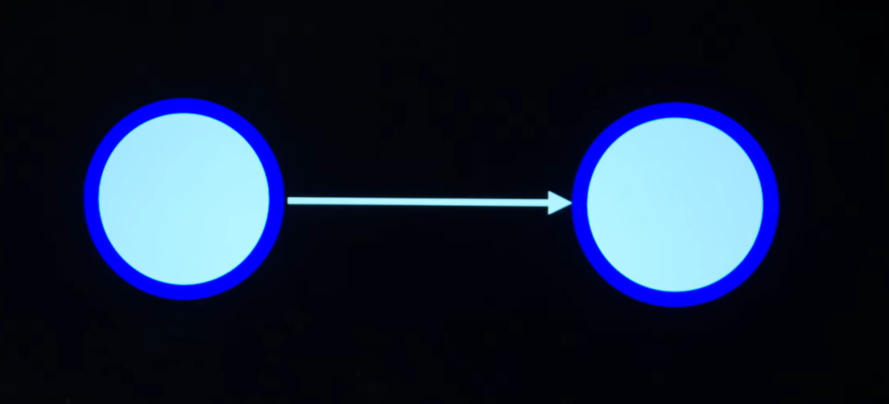
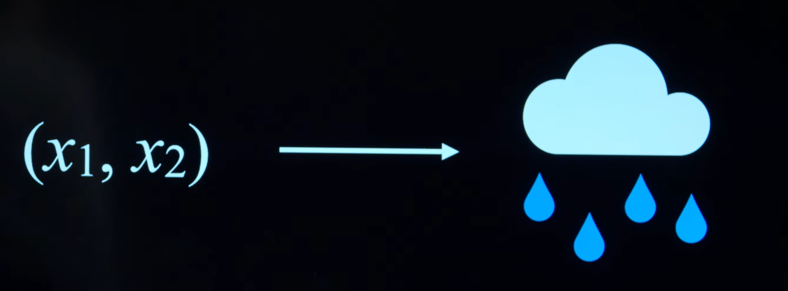
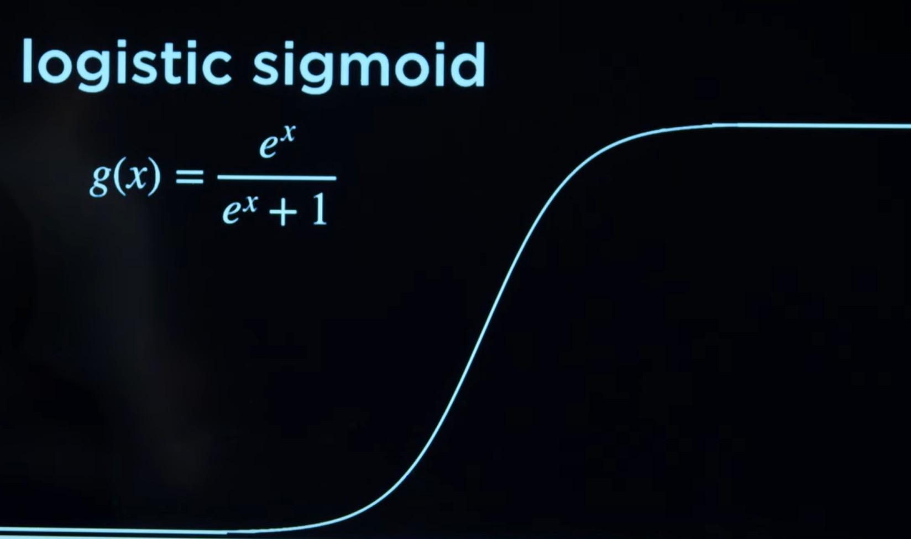
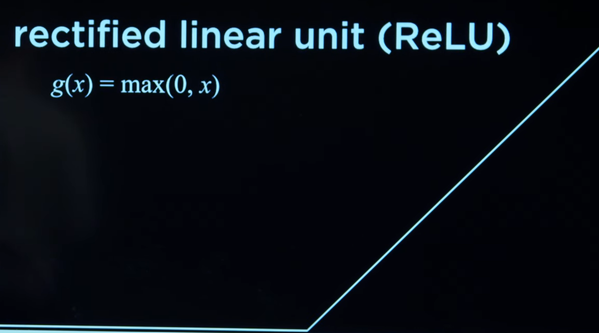
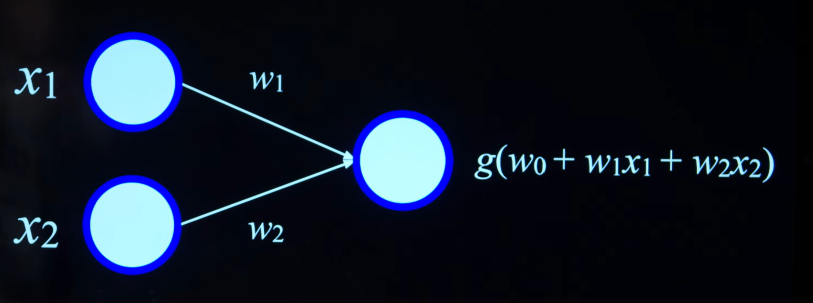
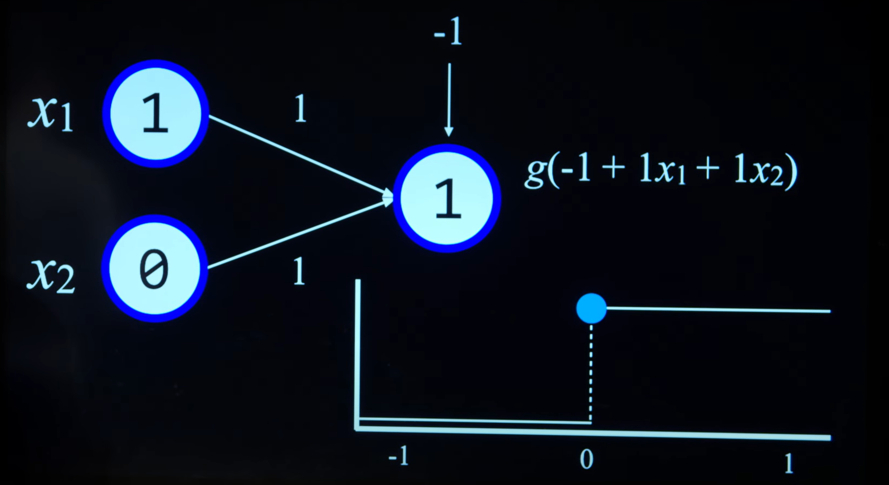
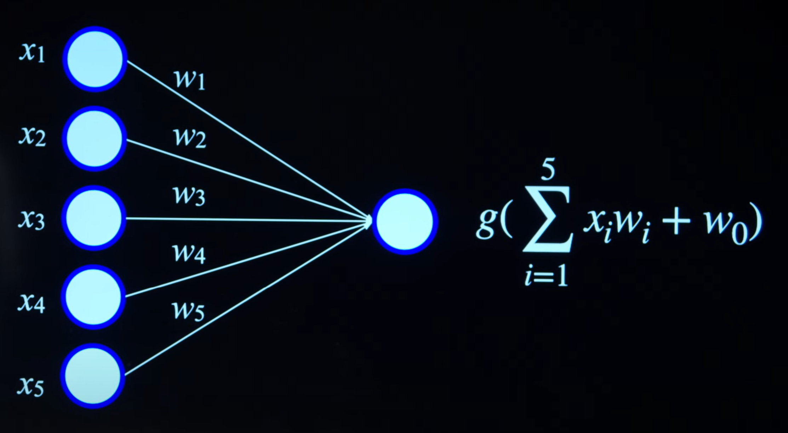

# Lecture 5 — Neural Networks

Anteriormente estuvimos echando un vistazo al aprendizaje automatico, donde una serie de algoritmos permitian reconocer patrones dados unos datos de entrenamiento. Los modelos de IA entrenados mediante aprendizaje automatico eran capaces tomar decisiones sobre que acciones efectuar sin necesidad de proporcionar explicitamente ordenes a estos.

En esta leccion transicionaremos a uno de los campos mas importantes en `machine learning`, hablamos de redes neuronales o `neural netorks`.

El concepto de redes neuronales surge sobre la decada de 1940 donde investigadores de la epoca estudiaban el funcionamiento del cerebo humano; especialmente, como este tenia la capacidad de aprendizaje y como este mismo concepto podria ser aplicado a computadoras.

Desde un punto de vista extremadamente simplificado, el cerebro es compuesto por un monton de neuronas interconectadas entre si, a partir de las cuales los cientificos encontraron los siguientes patrones:

- Las neuronas estan conectadas a... y reciben impulsos electricos de... otras neuroas.

- Tras recibir un impuso electrico, las neuronas se activan.

El plan de los cientificos por lo tanto era aplicar estos conceptos inspirados en estructuras biologicas de forma sintetica / artificial — redes neuronales sinteticas o `Artificial Neural Networks`.

# Artificial Neural Networks

Consiste en un modelo matematico pensado para el aprendizaje e inspirado en las redes neuronales biologicas.

- Modela una funcion matematica encargada de retornar unos determinados datos de salida dados unos datos de entrada y cuyo resultado depende de la estructura y parametros de la red neuronal.

- Permite el aprendizaje de los parametros de la red neuronal desde los datos.

Nuestras redes neuronales sinteticas se constiurian por "unidades" o `units` en lugar de neuronas biologicas — de ahora en adelante representaremos graficamente estas unidades con puntos azules.

Estas unidades podemos unirlas entre si, tal y como se trataran de neuronas reales.



> Entrada -> Salida

En inteligencia artificial (o en computer scince realmente) existen un monton de metodos de conseguir el mismo resultado, en este caso: codificar un modelo capaz de resolver una tearea concreta.

A lo largo de las lecciones de este curso hemos estudiado en numerosas veces tareas de prediccion:

- Teorema de bayes

- Modelos de markov

- Regresiones logisticas

Las redes neuronales sinteticas son definitivamente una opcion mas a la hora de lidiar con tareas de prediccion (imagina el clasico "llueve o no llueve")



> Ejemplo prediccion / clasificacion binaria.

Retomando la leccion anterior (mas especificamente si volvemos a la idea de regresion), volveremos a toparnos con el vector de pesos **W** y el vector de datos de entrada **X**.

```math
h(x_1, h_2) = w_0 * 1 + w_1 * x_1 + w_2 * x_2
```

> "$w_0$" es en ocasiones conocido por el termino "bias".

El objetivo para $h$ es encontrar los pesos mas adecuados para realizar con buenas precision las predicciones.

# Activation Functions

A partir del valor generado por esta funcion matematica de regresion, lo que buscamos es generar una clasificacion (tal y como ya comentamos en la anterior leccion, lo haremos a partir de ciertas funciones de activacion / clasificacion):

- **step function** — Si el valor de regresion es superior a 0, clasifica los datos como A, de lo contrario como B.

  > En clasificacion binaria, como es en este caso, consideramos "activacion" cuando la funcion de clasificacion categorize los datos como 1 en lugar de 0.

- **logistic sigmoid** — Como una mejora al anterior enfoque, la clasificacion mediante regresion logistica (lograda mediante el uso de la funcion matematica **logistic sigmoid**) introduce numeros flotantes al resultado clasificatorio (probabilidades)

  

- **rectified linear unit (ReLU)** — Consiste en una popular funcion de activacion donde la clasificacion se basa en $g(x)\ =\ max(0,\ x)$



# Neural Structure Structure

En realidad, gracias mismo enfoque de pesos **W** e inputs **X** podemos concebir la red neuronal mas sencilla posible. Solamente tenemos que representar graficamente esta idea para darnos cuenta.



Para codificar una red neuronal funcional y que cumpla con su cometido no solo sera necesario entrenar correctamente el vector **W**, si no que tambien sera necesario encontrar una funcion de activacion adecuada.

Por ejemplo, a continuacion una red neuronal encargada de resolver la operacion logica **OR**:



- $x_1$ — Puede ser $1$ o $0$.

- $x_2$ — Puede ser $1$ o $0$.

- $w_0$ — El peso adecuado es de $-1$.

- $w_1$ — El peso adecuado es de $1$.

- $w_2$ — El peso adecuado es de $1$.

Entonces la clasificacion final es de

$g(-1 + w_1 * x_1 + w_2 * x_2)$

Donde para $g$, todos los valores inferiores a $0$ son considerados como un resultado de clasificacion $0$, mientras que cualquier valor superior a esta misma cantidad es clasificado como $1$.

Para crear una red neuronal equivalente que calcule el operador **AND**, intercambiaremos $w_0$ en la funcion de activacion por un valor de $-2$.

Cada una de estas unidades de la red neuronal sintetica puede contener un valor discreto (escenarios de clasificacion como llueve o no llueve), o un valor numerico continuo (las ventas estimadas para el mes y el gasto en publicidads).

Hasta el momento hemos estado considerando redes neuronales unicamente de dos parametros; sin embargo, esta misma idea es escalable a un escenario con mayor grado de dimensionalidad.



# Gradient Descent

Si bien las redes neuronales relativas a los operadores logicos **OR** y **AND** son tan simples que incluso pueden ser configuradas sobre la marcha de manera manual (ajuste de pesos y funcion de activacion), en ocasiones es algo mas complicado.

Demandamos un mecanismo conveniente para entrenar los pesos de una red neuronal. Ahi es cuando entra `gradient descent`, cuyo objetivo es minimizar una funcion de perdida cuando entrenamos una red neuronal.

> Una funcion de perdida en el contexto de aprendizaje automatico calcula que tan "probre" es un modelo / ann generando predicciones.

Desciente por gradiente es capaz de predecir la pendiente de una funcion dados unos parametros de entrara y descender por dicha cuesta con el objetivo de minimizar el coste de la funcion; de esta manera es como conseguimos encontrar los pesos indicados.
