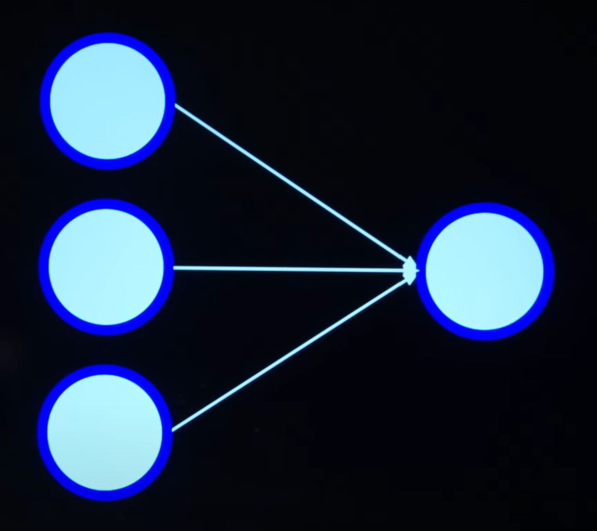
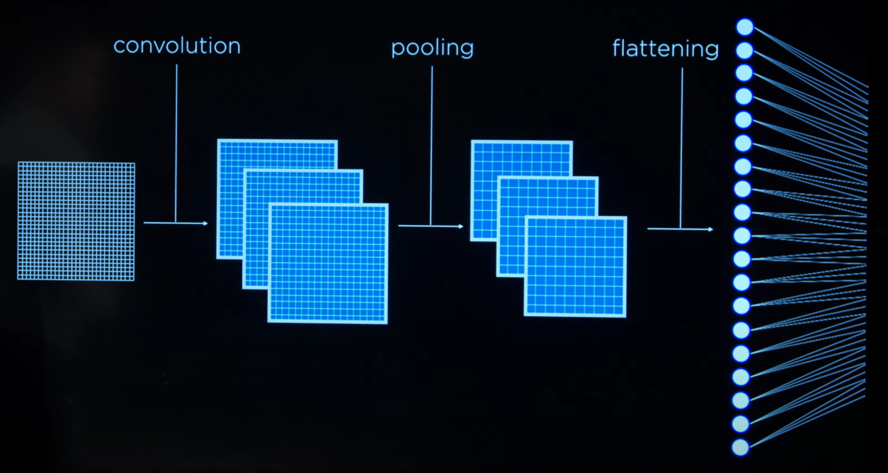

# Lecture 5 — Neural Networks

Anteriormente estuvimos echando un vistazo al aprendizaje automatico, donde una serie de algoritmos permitian reconocer patrones dados unos datos de entrenamiento. Los modelos de IA entrenados mediante aprendizaje automatico eran capaces tomar decisiones sobre que acciones efectuar sin necesidad de proporcionar explicitamente ordenes a estos.

En esta leccion transicionaremos a uno de los campos mas importantes en `machine learning`, hablamos de redes neuronales o `neural netorks`.

El concepto de redes neuronales surge sobre la decada de 1940 donde investigadores de la epoca estudiaban el funcionamiento del cerebo humano; especialmente, como este tenia la capacidad de aprendizaje y como este mismo concepto podria ser aplicado a computadoras.

Desde un punto de vista extremadamente simplificado, el cerebro es compuesto por un monton de neuronas interconectadas entre si, a partir de las cuales los cientificos encontraron los siguientes patrones:

- Las neuronas estan conectadas a... y reciben impulsos electricos de... otras neuroas.

- Tras recibir un impuso electrico, las neuronas se activan.

El plan de los cientificos por lo tanto era aplicar estos conceptos inspirados en estructuras biologicas de forma sintetica / artificial — redes neuronales sinteticas o `Artificial Neural Networks`.

# Artificial Neural Networks

Consiste en un modelo matematico pensado para el aprendizaje e inspirado en las redes neuronales biologicas.

- Modela una funcion matematica encargada de retornar unos determinados datos de salida dados unos datos de entrada y cuyo resultado depende de la estructura y parametros de la red neuronal.

- Permite el aprendizaje de los parametros de la red neuronal desde los datos.

Nuestras redes neuronales sinteticas se constiurian por "unidades" o `units` en lugar de neuronas biologicas — de ahora en adelante representaremos graficamente estas unidades con puntos azules.

Estas unidades podemos unirlas entre si, tal y como se trataran de neuronas reales.


> Entrada -> Salida

En inteligencia artificial (o en computer scince realmente) existen un monton de metodos de conseguir el mismo resultado, en este caso: codificar un modelo capaz de resolver una tearea concreta.

A lo largo de las lecciones de este curso hemos estudiado en numerosas veces tareas de prediccion:

- Teorema de bayes

- Modelos de markov

- Regresiones logisticas

Las redes neuronales sinteticas son definitivamente una opcion mas a la hora de lidiar con tareas de prediccion (imagina el clasico "llueve o no llueve")


> Ejemplo prediccion / clasificacion binaria.

Retomando la leccion anterior (mas especificamente si volvemos a la idea de regresion), volveremos a toparnos con el vector de pesos **W** y el vector de datos de entrada **X**.

```math
h(x_1, h_2) = w_0 * 1 + w_1 * x_1 + w_2 * x_2
```

> "$w_0$" es en ocasiones conocido por el termino "bias".

El objetivo para $h$ es encontrar los pesos mas adecuados para realizar con buenas precision las predicciones.

# Activation Functions

A partir del valor generado por esta funcion matematica de regresion, lo que buscamos es generar una clasificacion (tal y como ya comentamos en la anterior leccion, lo haremos a partir de ciertas funciones de activacion / clasificacion):

- **step function** — Si el valor de regresion es superior a 0, clasifica los datos como A, de lo contrario como B.

  > En clasificacion binaria, como es en este caso, consideramos "activacion" cuando la funcion de clasificacion categorize los datos como 1 en lugar de 0.

- **logistic sigmoid** — Como una mejora al anterior enfoque, la clasificacion mediante regresion logistica (lograda mediante el uso de la funcion matematica **logistic sigmoid**) introduce numeros flotantes al resultado clasificatorio (probabilidades)

  

- **rectified linear unit (ReLU)** — Consiste en una popular funcion de activacion donde la clasificacion se basa en $g(x)\ =\ max(0,\ x)$


# Neural Netowrk Structure

En realidad, gracias mismo enfoque de pesos **W** e inputs **X** podemos concebir la red neuronal mas sencilla posible. Solamente tenemos que representar graficamente esta idea para darnos cuenta.


Para codificar una red neuronal funcional y que cumpla con su cometido no solo sera necesario entrenar correctamente el vector **W**, si no que tambien sera necesario encontrar una funcion de activacion adecuada.

Por ejemplo, a continuacion una red neuronal encargada de resolver la operacion logica **OR**:


- $x_1$ — Puede ser $1$ o $0$.

- $x_2$ — Puede ser $1$ o $0$.

- $w_0$ — El peso adecuado es de $-1$.

- $w_1$ — El peso adecuado es de $1$.

- $w_2$ — El peso adecuado es de $1$.

Entonces la clasificacion final es de

$g(-1 + w_1 * x_1 + w_2 * x_2)$

Donde para $g$, todos los valores inferiores a $0$ son considerados como un resultado de clasificacion $0$, mientras que cualquier valor superior a esta misma cantidad es clasificado como $1$.

Para crear una red neuronal equivalente que calcule el operador **AND**, intercambiaremos $w_0$ en la funcion de activacion por un valor de $-2$.

Cada una de estas unidades de la red neuronal sintetica puede contener un valor discreto (escenarios de clasificacion como llueve o no llueve), o un valor numerico continuo (las ventas estimadas para el mes y el gasto en publicidads).

Hasta el momento hemos estado considerando redes neuronales unicamente de dos parametros; sin embargo, esta misma idea es escalable a un escenario con mayor grado de dimensionalidad.


# Gradient Descent

Si bien las redes neuronales relativas a los operadores logicos **OR** y **AND** son tan simples que incluso pueden ser configuradas sobre la marcha de manera manual (ajuste de pesos y funcion de activacion), en ocasiones es algo mas complicado.

Demandamos un mecanismo conveniente para entrenar los pesos de una red neuronal. Ahi es cuando entra `gradient descent`, cuyo objetivo es minimizar una funcion de perdida cuando entrenamos una red neuronal.

> Una funcion de perdida en el contexto de aprendizaje automatico calcula que tan "probre" es un modelo / ann generando predicciones.

Desciente por gradiente es capaz de predecir la pendiente de una funcion dados unos parametros de entrara y descender por dicha cuesta con el objetivo de minimizar el coste de la funcion; de esta manera es como conseguimos encontrar los pesos indicados.

Cabe destacar que en la leccion anterior estuvimos trabajando con `perceptron learning rule` para entrenar **W**; sin embargo, dicha regla no es aplicable a redes neuronales modernas dadas sus limitaciones en terminos de:

- Escenarios multiclase (en lugar de clasificaciones binarias)

- Clasificacion de datos no lineales

Hoy en dia esta regla es mas bien considerada desde el punto de vista didactico.

Podemos describir el funcionamiento de descenso por gradiente de la siguiente forma:

1. En primer lugar elegimos un numero de unidades de la red neuronal aleatoriamente.

2. Para tales unidades buscaremos la pendiente en la funcion de perdida gracias todos a los datos de entrenamiento (`data points`).

3. Conociendo la direccion / pendiente moveremos en consecuencia los pesos.

4. Repetimos el proceso volviendo al paso $2$.

Tras repetir multiples veces este mismo proceso (el tamaño de los saltos en los pesos puede variar), deberiamos terminar una solucion realmente buena en este escenario de clasificacion.

El terminos de costo computacional, lo mas caro suele ser el proceso de calculo de pendiente para absolutamente **todos los puntos de datos** del entrenamiento.

# Stochastic Gradient Descent

Es algo mas barato en terminos de de costo computacional. La principal diferencia radica en el calculo de la pendiente, donde a diferencia de en descenso por gradiente, esta es calculada solo sobre un `data point` del entrenamiento al mismo tiempo.

1. Comenzamos eligiendo un numero de unidades de la **ann** aleatoriamente.

2. Nos centraremos en un solo punto de datos del entrenamiento elegido aleatoriamente y calcularemos su pendiente.

3. Desplazaremos los pesos de las unidades de acuerdo con la pendiente de dicho punto de datos.

4. Repetimos el mismo proceso volviendo al paso $2$.

Cabe destacar que este metodo va a ser menos preciso con respecto al descenso de gradiente tradicional, pero ofrece un rendimiento mejorado.

# Mini-Batch Gradient Descent

Consiste en un popular termino medio entre ambos. En lugar de hacer los calculos de pendiente sobre uno o todos los puntos del entrenamiento, un lote con una cantidad constante puntos de puntos datos (lote considerablemente mas pequeño que la totalidad de los datos del entrenamiento), sera tomado para hacer los calculos de direccion de pendiente.

---

Si se presta atencion, hasta el momento todas la **ann** que hemos estado viendo tienen la forma:



Sin embargo; es totalmente factible dar con redes neuronales que esperan multiples valores de salida. Una **ann** con multiples valores de salida se representa graficamente de la siguiente manera:


> Escenario multiclase para clasificar el tiempo.

Se calcula el dot product entre el vector de datos de entrada y los pesos entrenados para cada unidad neuronal; cada unidad neuronal de salida percibe el valor y se ejcuta una funcion de activacion (la cual puede involucrar simples valores discretos o valores numericos continuos representando probabilidades).

De esta manera hemos logrado un escenario donde una **ann** genera un vector de datos de salida, formando una distribucion de probabilidad multiclase.

Para entrenar los pesos de una red neuronal con un vector de datos de salida (en lugar de un solo output), podemos emplear una tecnica que consiste en segmentar la red en subredes mas pequeñas, entrenando cada uno de sus pesos de forma independiente.


> Podemos adoptar esta perspectiva de subredes porque los inputs estan directamente conectados a los outputs.

# Deep Neural Networks

Hasta el momento hemos puesto encima de la mesa modelos de redes neuronales que pueden hacer un trabajo realmente bueno clasificando datos lineales; sin embargo, esto puede llegar a ser un escenario idealizado y en ocasiones nuestra **ann** tendra que lidiar con casos mas realistas e irregulares (casos donde posiblemente los datos no sean linealmente separables).

Todas estas **ann** que estamos estudiando se basan en `perceptron learning rule` de una sola capa; es decir, los datos de entrada son directamente asociados a la salida, no existe ninguna capa oculta de perceptrones entre medias de la entrada y la salida.

Adoptar un modelo multicapa es una estrategia a considerar si se busca separar datos linealmente no separables.


En un **ann** con capas de perceptrones ocultas, existe en paso intermedio de asociacion de valores de entrada con valores de salida, solo que tales valores de salida en el fondo forman a su vez valores de entrada para la proxima capa de perceptrones / output final.

## Backpropagation

Como es de esperar, el proceso de entrenamiento de una **ann** con multicapa de perceptron es diferente al de las redes que vimos con anterioridad, donde las unidades neuronales de entrada estaban directamente conectadas a la salida.

La principal dificultar que encontrariamos al entrenar una **ann** si continuaramos con el mismo enfoque de aprendizaje de perceptron que hemos etado viendo, es que en los datos de entrenamiento no se proporciona ningun etiqueta de referencia con la que basarnos para entrenar los pesos de las unidades ocultas.

Una una solucion a este problema de etiquetamiento en unidades ocultas consite en un modelo matematico basado en una funcion de perdida para los resultados de estimacion de de la **ann**.

A traves de este metodo, y por medio de un calculo de implicacion por parte de las unidades de entrada de cada capa en la generacion de errores relativa a la funcion perdida, es posible retropropagar los ajustees necesarios en los pesos de cada unidad de la red neuronal sintetica.

Esta es precisamente la labor de un algoritmo de `backpropagation` o retropropagacion.

- En primer lugar comenzamos eligiendo una determinada cantidad de unidades.

- Calculamos con la funcion de perdida el error para el output.

- Para cada capa, comenzando desde el output y desplazandonos entre capas hasta llegar a la primera capa oculta:

  - Propagaremos el error una capa hacia atras.
  - Actualizaremos los pesos de las unidades.

# Overfitting

En la anterior leccion ya vimos el concepto de overfitting desde una perspectiva general de clasificacion en `machine learning`.

Sin embargo, las redes neuronales tambien pueden correr el mismo riesgo a sufrir `overfitting`, perdiendo generalidad y estimando pesimanete datos no provistos como parte del entrenamiento del modelo.

## Dropout

Consiste en una tecnica para mitigar el problema de overfitting y al mismo tiempo generar robusted promoviendo la no dependencia en exceso sobre las unidades.

Consiste en eliminar temporalmente de la red ciertas unidades elegidas aleatoriamente.


# TensorFlow

Desde una perspectiva de programacion, existen muchas librerias para muchos lenguajes de programacion que implementan estos algoritmos de redes neuronales.

`TensorFlow` es la implementacion de todos estos algoritmos por parte de **Google**. Con `TensorFlow` podemos facilmente (y sin necesidad de implementar estos algoritmos por nuestra propia cuenta), modelar, entrenar y probar sobre unos datos de muestra estas redes neuronales.

# Computer Vision

Consiste en el proceso de entendimiento por parte de las computadoras de imagenes digitales gracias a diferentes metodos.

Usos populares de `computer vision`:

- Identificar personas en imagenes (handwritting)

- Vehiculos de conduccion autonoma (tesla)


En el contexto de las redes neuronales, es intuitivo pensar que cada pixel de una imagen podria representar una unidad de entrada diferente.

Podemos considerar de varias formas un pixel, probablemente la mas simple seria como un valor booleano discreto, donde $1$ es blanco y $0$ negro.

Una forma algo mas avanzada consistiria en la introduccion de tonos grises; es decir, cada valor de entrada podria considerarse como un byte con un rango del $0$ al $255$.

Si lo que buscaramos fuese el procesamiento de imagenes a color, habria que optar por un sistema de combinacion para la intensidad de los colores **rojo**, **verde** y **azul**.

## Image Convolution

Entrenar una **ann** para procesamiento de imagenes puede conllevar millones de unidades de entrada, pues necesitamos una para cada pixel de la imagen. Aun pudiendo procesar tal cantidad de entradas en una red neuronal, distinguir patrones en imagenes seria una tarea extremadamente complicada (mas aun teniendo en cuenta el posible ruido e informacion irrelevante que puede estar presente en estas)

La convolucion de imagenes consiste en una tecnica para extraer la informacion mas significativa de de las mismas; lo que nos facilitara la deteccion de patrones al momento de procesar estas por parte de un modelo.

- Trazos

- Formas

- Predominancias de color en ciertas areas

La tecnica se basa en la aplicacion de un filtro en forma de matriz con valores numericos sobre la imagen original.

Cada valor de cada pixel de la imagen original se multiplica por el correspondiente valor del filtro y posteriormente todos estos valores son sumados. Este mismo proceso es repetido desplazando el filtro a lo largo de la imagen, siendo los resultados de esta operacion los nuevos valores que conformaran la imagen resumen (apta para su procesamiento por una **ann**)


> Este mismo proceso donde desplazamos el filtro puede ser configurado (la cantidad de pixeles por desplazamiento)

A continuacion un famoso filtro o matriz de kernel:

|     |     |     |
| --- | --- | --- |
| -1  | -1  | -1  |
| -1  | 8   | -1  |
| -1  | -1  | -1  |

Al ser aplicado a una zona homogenea de la imagen (todos los pixeles cubiertos por el filtro tienen la misma intensidad), obtendremos un valor de $0$.


Gracias a este sistema donde detectamos la homogeneidad de la imagen en ciertas areas podemos empezar a crear conclusiones sobre en que zonas de la imagen pueden exisitr ciertos limites, formas, patronse, etc.


> Real example of an image that were generated through this same filter and PIL (python image library)

Existen matrices de kernel diseñadas en particular para imagenes a color; utiles para detectar predominancia de color en ciertas areas de una imagen (no es una tecnica limitada a imagenes bicolor).

La cuestion es que incluso tras haber pasado las imagenes por estos filtros con el objetivo de resaltar la informacion mas relevante en estas, la cantidad de pixeles que una imagen puede presentar es simplemente abismal. Esto implicaria disponer de una cantidad de unidades neuronales de entrada **insana**; ademas (y viendolo desde una perspectiva humana), nuestro reconocimiento de imagenes no se basa en el analisis individual de los pixeles, en su lugar, nos fijamos en grandes agrupaciones de los mismos y como estos estan ubicados en que regiones de la imagen.

# Pooling

Consiste en una tecnica para reducir el tamaño de los datos de entrada mediante mecanismos de muestreo sobre los mismo.

En el contexto del procesamiento de imagenes con grandes cantidades de pixeles, `pooling` es permite reducir el tamaño de imagenes en terminos de pixels, tratando mantener la informacion mas relevante de las mismas (sin embargo siempre hay perdida de informacion, es inevitable).

## Max Pooling

De acuerdo para generar la version simplificada de la imagen, se obtiene el valor mas grande correspondiente a cada pixel de la muestra.


# Convolutional Neural Networks

Consiste precisamente en redes neuronales sinteticas que combinan tecnicas de convolucion y pooling principalmente para el procesamiento de imagenes digitales.

1. En primer lugar las imagenes de entrada pasan por una etapa de convolucion para generar lo que conocemos como un `feature map`. Por lo general emplearemos diferentes filtros, cada uno especializado en extraer ciertas caracteristicas relevantes de la imagen (trazos en el caso del filtro $[-1, -1, -1, -1, 8, -1, -1, -1, -1]$). Es totalmente de esperar que la configuracion que empleemos para estos filtros afectara directamente a la `loss function` de la **ann** (sera necesario por lo tanto un trabajo de minimizacion para la funcion de perdia probando diferentes configuracion para los filtros).

2. Tras obtener las nuevas imagenes generadas a traves de los filtros, aplicaremos pooling sobre las mismas para reducir su tamaño en terminos de pixeles (max pooling, average pooling... o el criterio que mejor se adapte al tipo de imagenes)

3. Por ultimo, todas las imagenes optimizadas por `pooling` seran aplanadas o combinadas entre si para formar la entrada en la **ann**.



Si tras todo este proceso las imagenes siguen siendo demasiado grandes o sigue habiendo dificultad para extraer patrones (y queremos mantener el modelo de **ann**), el camino a seguir es por lo tanto seguir optimizando los datos de entrada repitiendo multiples veces este mismo proceso.
